# Kustomize (and Helm)

## Example of Kustomize

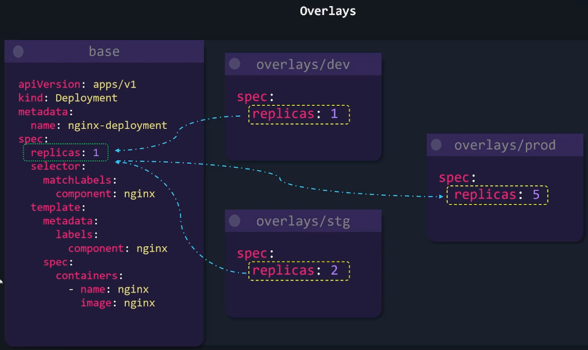

## Example of project structure


```
k8s/
|-- base/
     |--- ingress.yaml
     |--- deployment.yaml
|-- overlays/
         |--- dev/
               |--- kustomization.yaml
               |--- config-map.yaml
         |--- stg/
               |--- kustomization.yaml 
               |--- config-map.yaml
         |--- prd/
               |--- kustomization.yaml 
               |--- config-map.yaml
```

Words `base` and `overlays` are reserved names

The file `kustomization.yaml` is a reserved name	

`base` directory contains the default behaviour
`overlays` directory contains the customizations for each component


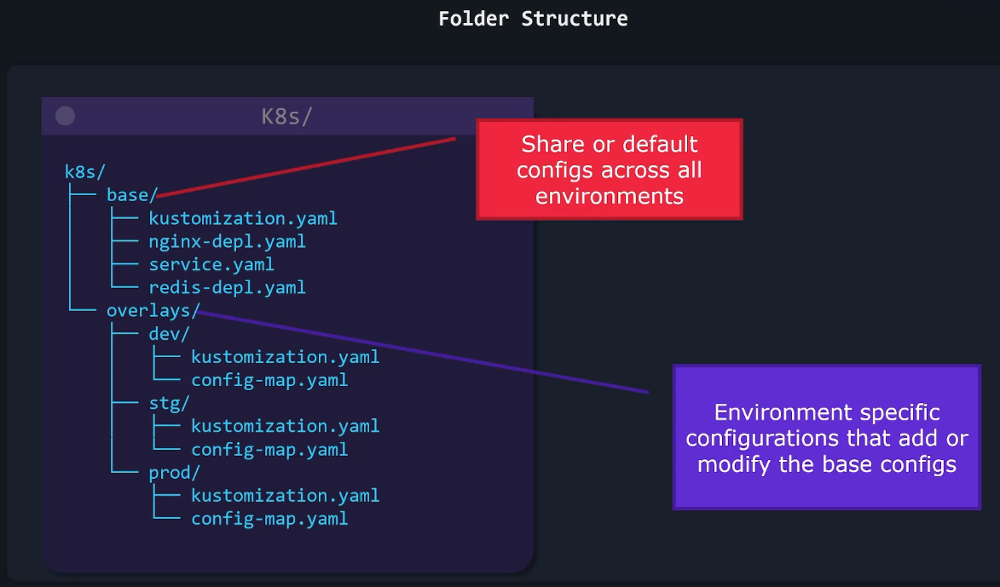


## Helm

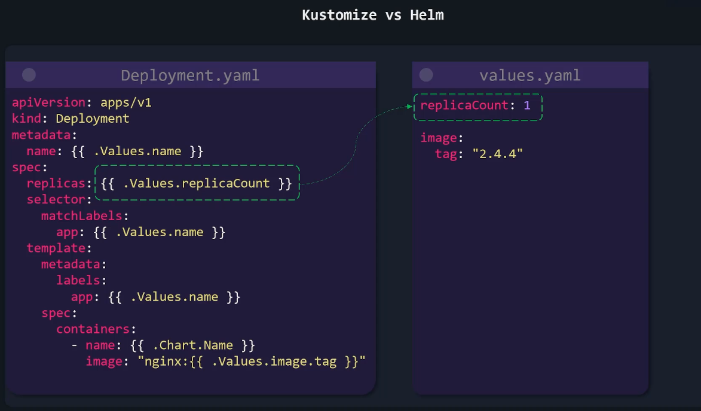


## Kustomization.yaml file

`kustomization.yaml` file is a file with a dedicated name.
It must contain a list of files that will be kustomized and a link to the customizations.

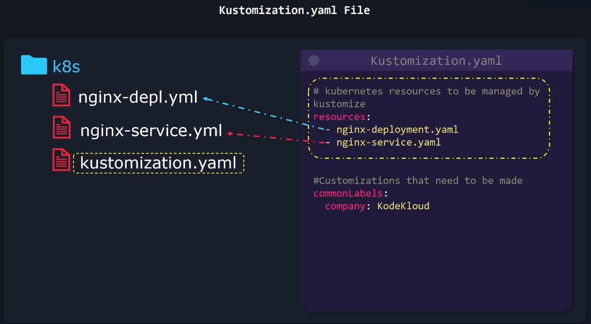

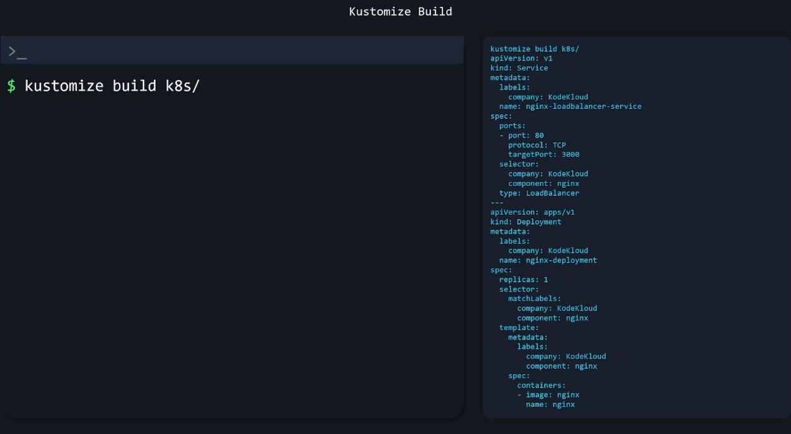

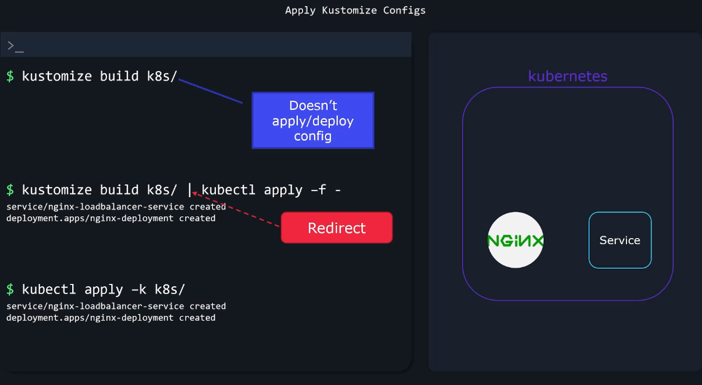

And to reverse

```
kustomize build k8s/ | kubectl delete -f
```

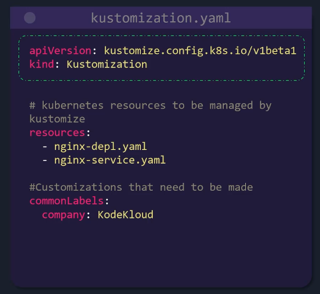


## Multiple directories management

Before kustomization

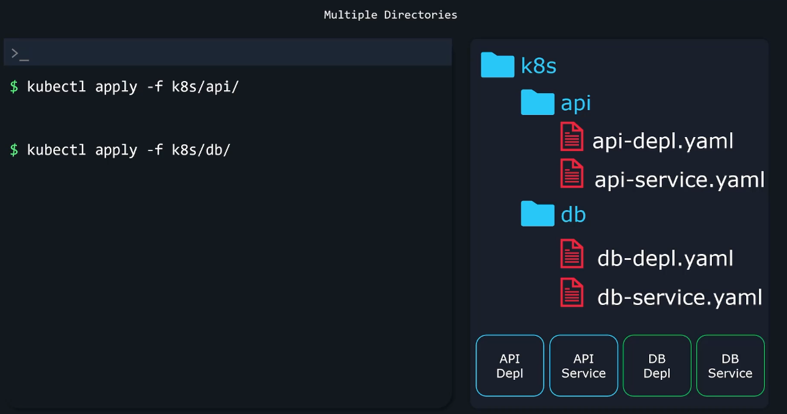

After kustomization

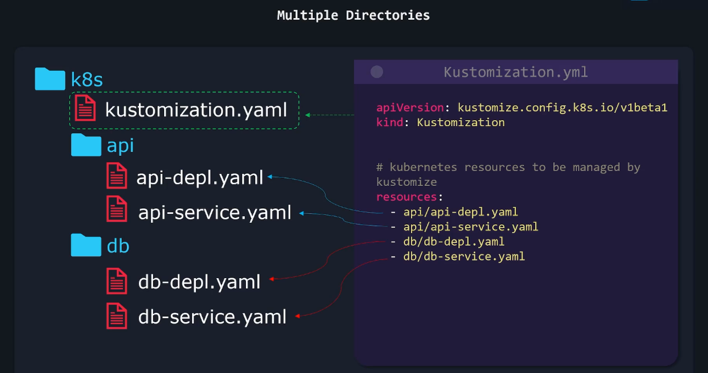

```
kustomize build k8s/ | kubectl apply -f

OR ( pay attention of the parameter, it's not "apply -f" but "apply -k" )

kubectl apply -k k8s/
```

Even more complex

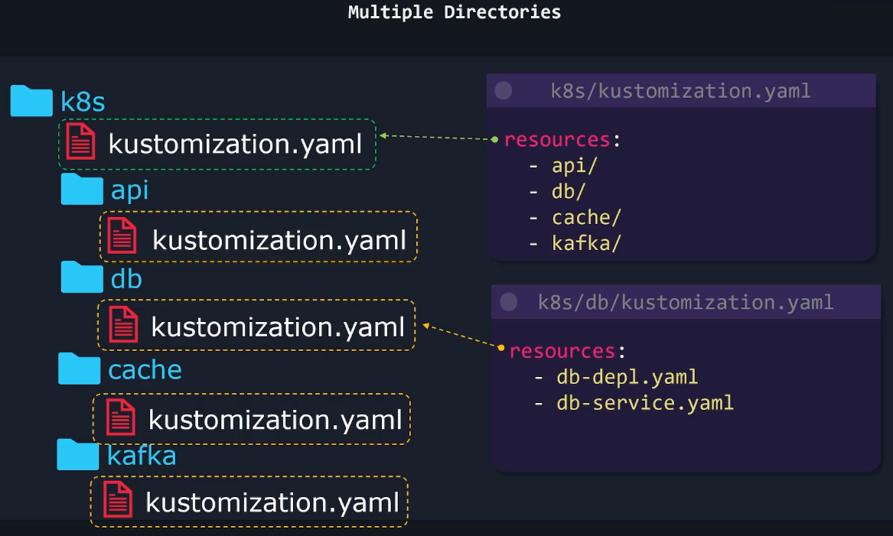


## practice

https://learn.kodekloud.com/user/courses/udemy-labs-certified-kubernetes-administrator-with-practice-tests/module/f868dfbe-80b2-44cf-97e7-d00fc0d91307/lesson/cc61109a-4e64-441d-9896-b25712f0d63c

To autocreate `kustomization.yaml` 

```
kustomize create --autodetect

# If there are yaml files in the current directory a "ressource" tag listing all the yamls files are done
```

Apply

```
kubectl apply -k k8s/
```

And of course you can include directories

```
apiVersion: kustomize.config.k8s.io/v1beta1
kind: Kustomization
resources:
- db/
- message-broker/
- nginx/
```

OR you can list

```
apiVersion: kustomize.config.k8s.io/v1beta1
kind: Kustomization
resources:
- db/pouet.yaml
- db/encore.yaml
- message-broker/un.yaml
- message-broker/deux.yaml
```


## Common keywords

Kustomize can have many common keywords

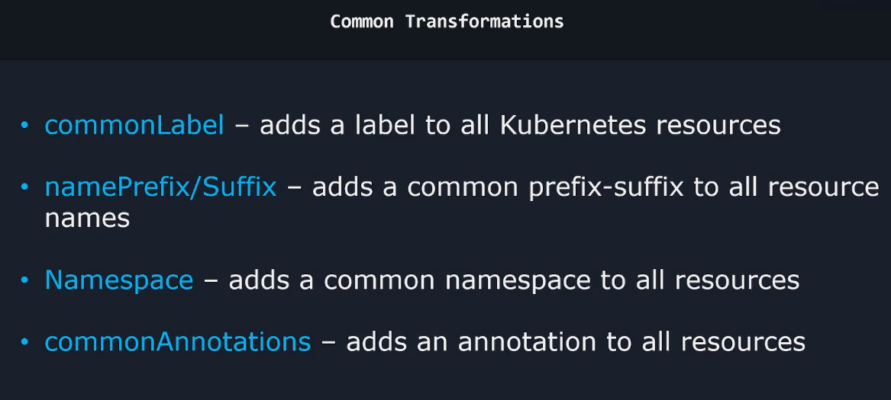

Example common labels

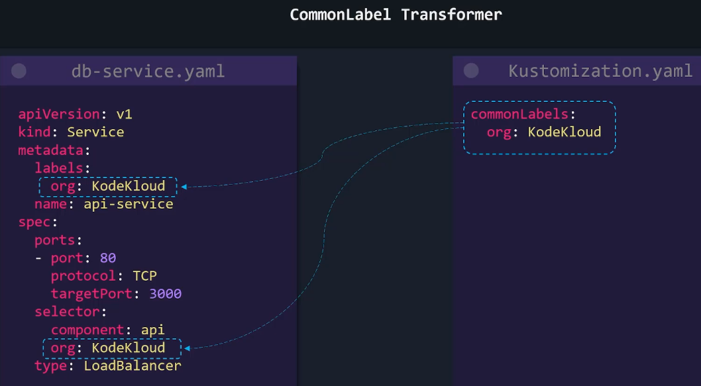

Example again : 

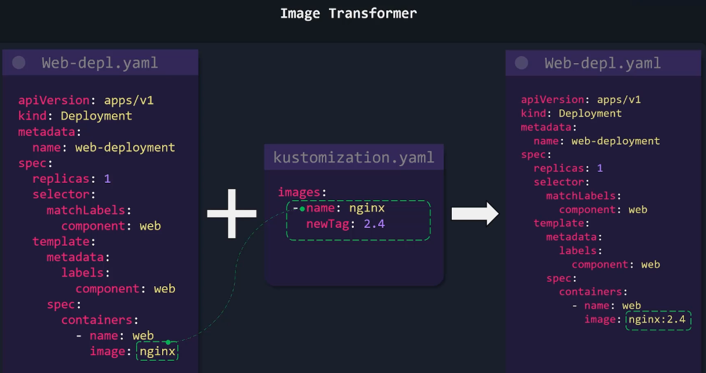

Example again 3 :

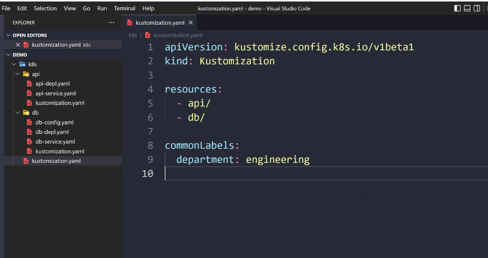

## Practice

https://learn.kodekloud.com/user/courses/udemy-labs-certified-kubernetes-administrator-with-practice-tests/module/f868dfbe-80b2-44cf-97e7-d00fc0d91307/lesson/2b58089b-bdb2-49bb-ac98-e1a8799c5526


```
apiVersion: kustomize.config.k8s.io/v1beta1
kind: Kustomization

resources:
  - nginx-depl.yaml
  - nginx-service.yaml

commonAnnotations:
  owner: bob@gmail.com
```

```
apiVersion: kustomize.config.k8s.io/v1beta1
kind: Kustomization

resources:
  - grafana-depl.yaml
  - grafana-service.yaml

namespace: logging

commonAnnotations:
  owner: bob@gmail.com
```

k8s/kustomization.yaml

```
apiVersion: kustomize.config.k8s.io/v1beta1
kind: Kustomization

resources:
  - db/
  - monitoring/
  - nginx/

commonLabels:
  sandbox: dev

images:
  - name: postgres
    newName: mysql
```


k8s/nginx/kustomization.yaml

```
apiVersion: kustomize.config.k8s.io/v1beta1
kind: Kustomization

resources:
  - nginx-depl.yaml
  - nginx-service.yaml

commonAnnotations:
  owner: bob@gmail.com

images:
  - name: nginx
    newTag: "1.23"
```


## Patch

As we saw, kustomization.yaml is a way to include yaml describing sources.
Patches are part of kustomization.yaml, meant to overload an existing variable.

A good example of usage of patches is to include a suffix for environments.
Here an example were the name of a deployment is changed


You can have patches directly described in the kustomization file OR a list of inclusions describing each patch.

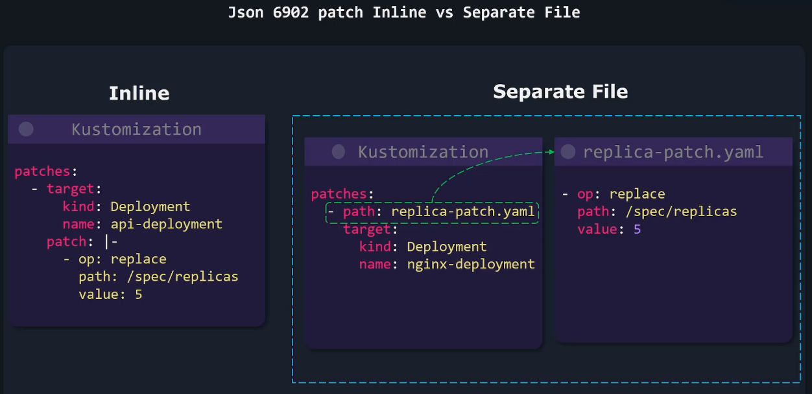

Here another example of list of patches.

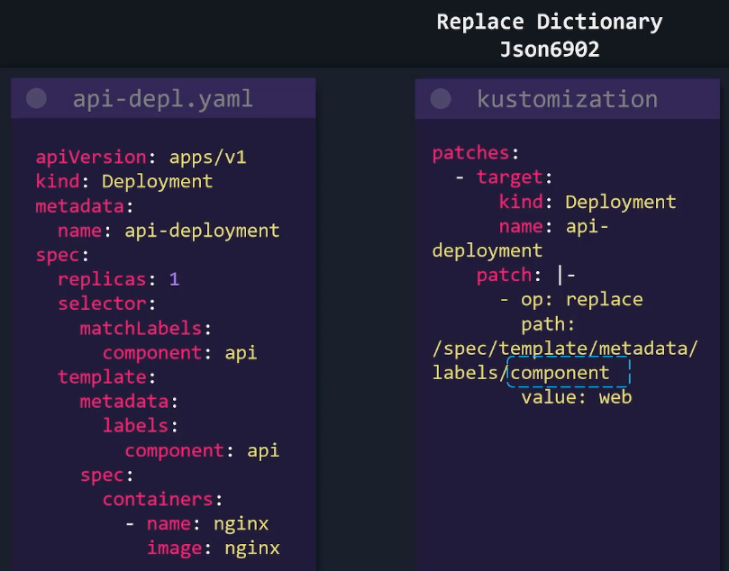

And even simplier to work with !!

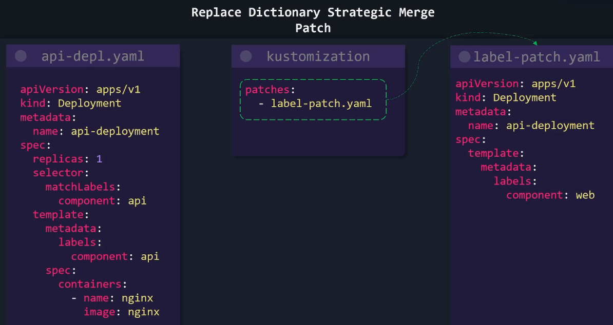

And you can even remove a field

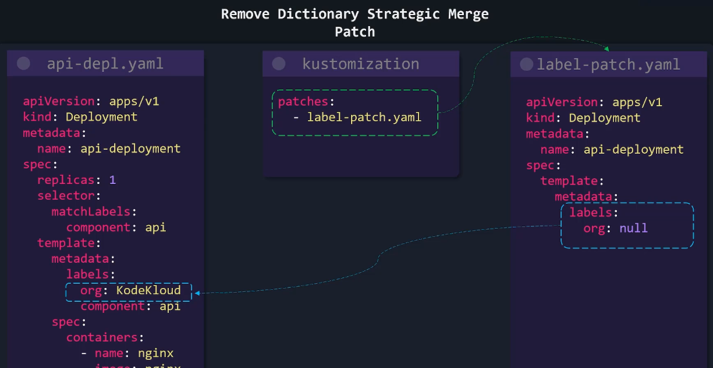

And here another way to remove something

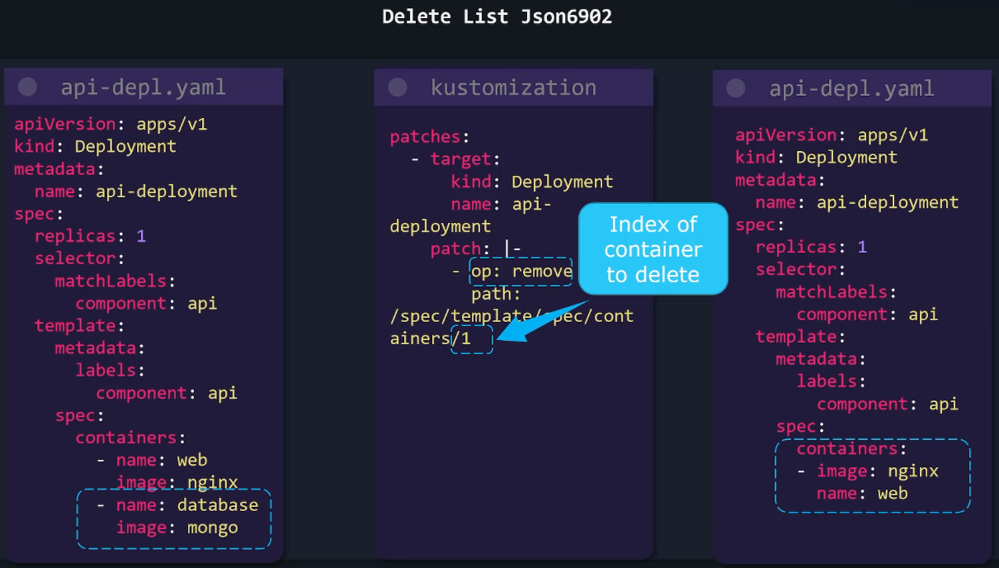

## Pratice lab

https://learn.kodekloud.com/user/courses/udemy-labs-certified-kubernetes-administrator-with-practice-tests/module/f868dfbe-80b2-44cf-97e7-d00fc0d91307/lesson/919f7a3a-8ba1-4c84-a363-2108c51fff1d


```
apiVersion: apps/v1
kind: Deployment
metadata:
  name: api-deployment
spec:
  template:
    spec:
      containers:
        - $patch: delete
          name: memcached
```

```
patches:
  - target:
      kind: Deployment
      name: mongo-deployment
    patch: |-
      - op: remove
        path: /spec/template/metadata/labels/org
```

to be put in kustomization.yaml

```
patches:
  - target:
      kind: Deployment
      name: mongo-deployment
    patch: |-
      - op: remove
        path: /spec/template/metadata/labels/org
```


## Overlays

Overlays are another way to formalize customizations.
Usually it's used to seperate customizations per env.

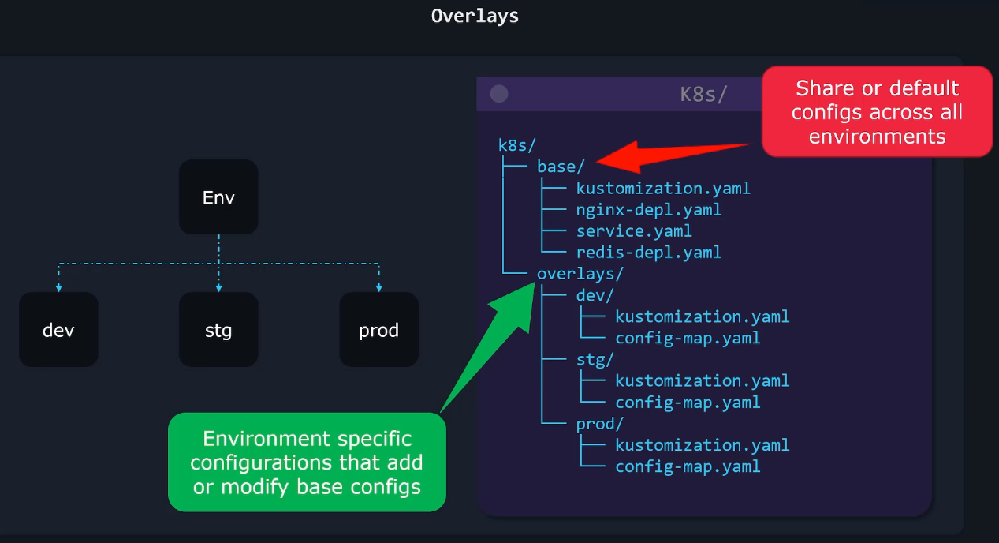

Example again

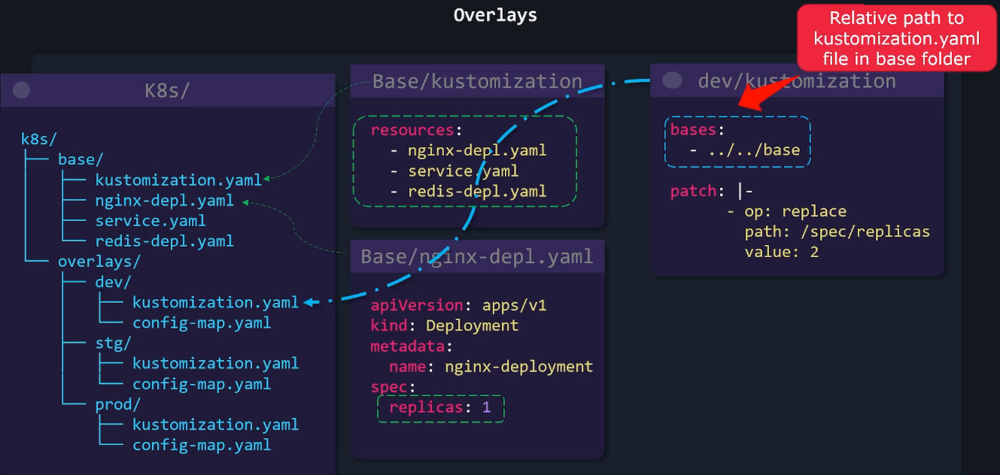

Of course those local kustomization.yaml files contained in dev/stg/prod can point to new resource (whole kind) files.
Here in the example, the add of a nginx deployment in prod.

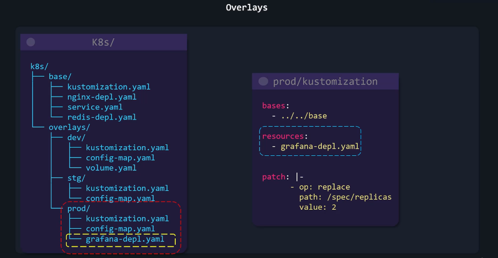

Here an example that shows that kustomizations can become really hard to follow, but it works.

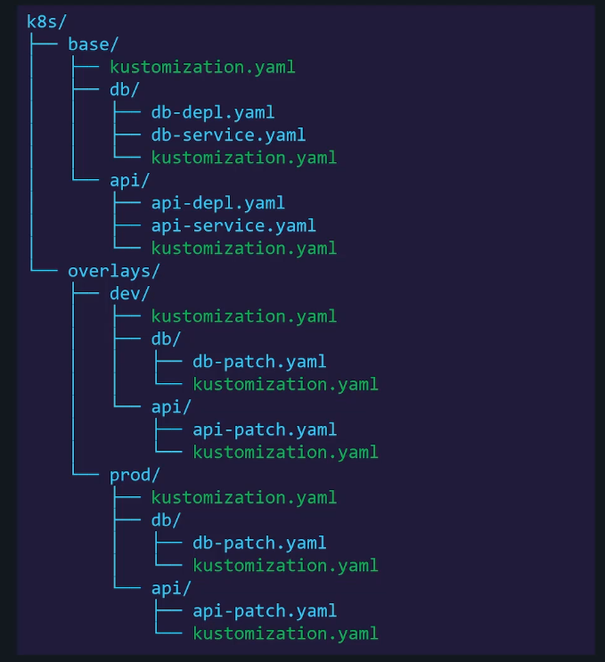

## Practice

https://learn.kodekloud.com/user/courses/udemy-labs-certified-kubernetes-administrator-with-practice-tests/module/f868dfbe-80b2-44cf-97e7-d00fc0d91307/lesson/a2d3ef06-b264-41a2-8e13-2ec409afabfe

Mostly stuff about looking for overlays.


## Components

Reusable pieces of configuration

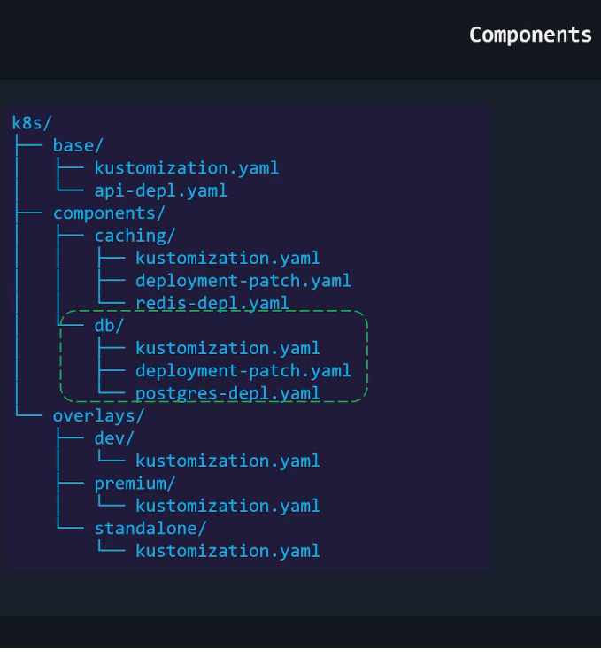

There is a point where it becomes to hard to be read.

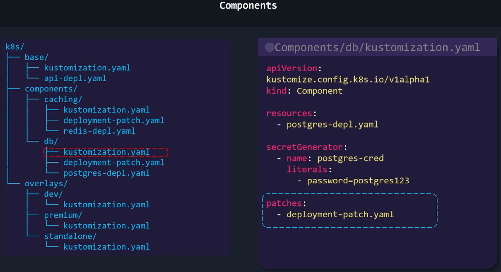


- **Patches** are often used in overlays.
- **An overlay** can integrate components to better structure the configuration.
- **A component** is like a Lego brick that can be used in multiple overlays.

| Element       | Definition                                                                 | Main Use Case                                              | Scope                      | Typical Example                            |
|---------------|-----------------------------------------------------------------------------|-------------------------------------------------------------|-----------------------------|---------------------------------------------|
| **Patch**     | Targeted modification of an existing manifest (via strategic merge or JSON) | Change a specific field of a resource                      | Local to a resource         | Modify the image of a Deployment            |
| **Overlay**   | A Kustomize directory based on one or more *bases*, with optional patches   | Adapt a base for an environment (dev, prod, staging…)      | Environment-specific        | Dev deployment with fewer replicas          |
| **Component** | Reusable block of configuration (kustomization.yaml + resources)            | Reuse independent functionality                            | Modular and reusable        | Add a sidecar container or monitoring setup |


Let's guess this project, when we add a sidecar to a deployment

```
my-app/
├── base/
│   ├── deployment.yaml
│   └── kustomization.yaml
├── overlays/
│   ├── staging/
│   │   ├── kustomization.yaml
│   │   └── ...
├── components/
│   └── debug-sidecar/
│       ├── patch-sidecar.yaml
│       └── kustomization.yaml

```


The file components/debug-sidecar/patch-sidecar.yaml describes the sidecar.

```
apiVersion: apps/v1
kind: Deployment
metadata:
  name: my-app
spec:
  template:
    spec:
      containers:
      - name: debug
        image: busybox
        command: ["sleep", "3600"]
```

The components/debug-sidecar/kustomization.yaml file in the component, will only point on the patch-sidecar.yaml file

```
resources: []
patches:
  - path: patch-sidecar.yaml
```

Then you will have an overlay, a customization for the environment in our case, that point on the base file on one side, and point on the component on the other side.
It basically means "hey for this overlay, deploy all the base + this component !!"

file: overlays/staging/kustomization.yaml

```
resources:
  - ../../base
components:
  - ../../components/debug-sidecar
```


So in our case, the deployment of the base in staging will add the debug-sidecar too.

SO we have the file tree :

```
my-app/
├── base/
├── overlays/
│   └── staging/
├── components/
```

To debug this project : 

```
cd my-app/
kubectl kustomize overlays/staging
```

To deploy this project :

```
kubectl apply -k overlays/staging
```

So you "deploy the overlay" to deploy everything which is related to this overlay.

## Practices

Related to components codes : 

https://learn.kodekloud.com/user/courses/udemy-labs-certified-kubernetes-administrator-with-practice-tests/module/f868dfbe-80b2-44cf-97e7-d00fc0d91307/lesson/66fefe64-87fd-4d25-a46f-c66dce62def7


TODO : To be redone later


