	
# core concepts


Kubernetes is a cluster

- worker nodes
- Containers/pods
- Kube-scheduler
- Controle manager
- Node controller
- Replication controller
- etcd cluster
- kube-apiserver
- kubelet
- kube-proxy

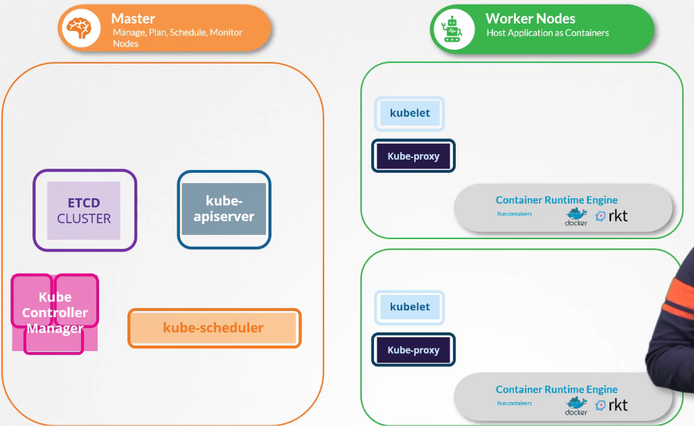


## Command line

`ctr` associated to ContainerD
- not very user friendly 
- only supports limited features
- mostly made for debugging
- replaced by `nerdctl` much more user friendly

```
ctr image pull docker.io/library/redis:alpine
ctr run docker.io/library/redis:alpine
```

`nerdctl`
- provide a docker-cli command line for containerD
- supports docker compose
- support a few advanced features


```
nerdctl run --name redis redis:alpine
nerdctl run --name webserver -p 80:80 -d nginx
```

`crictl`
An additional tool, not installed with docker, which uses the CRI (container runtime interface) to manipulate the runtime (dockerd/containerd/rkt)

```
crictl pull busybox
crictl run --name busybox
crictl pods
crictl log
```

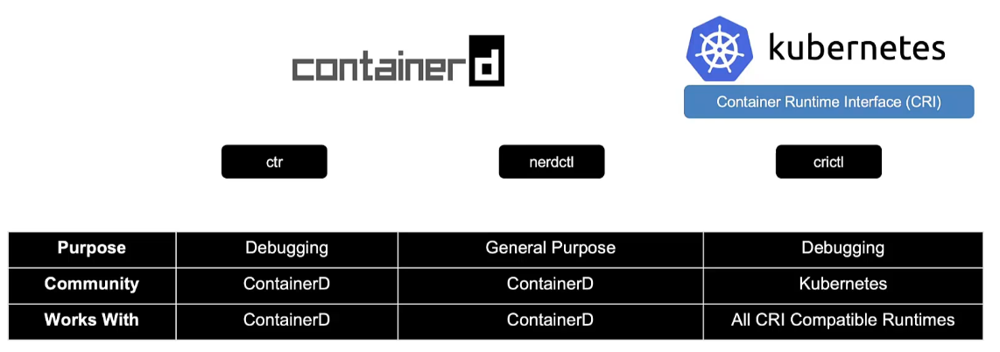


## ETCD


Base de données distribuée fonctionnant par key-value

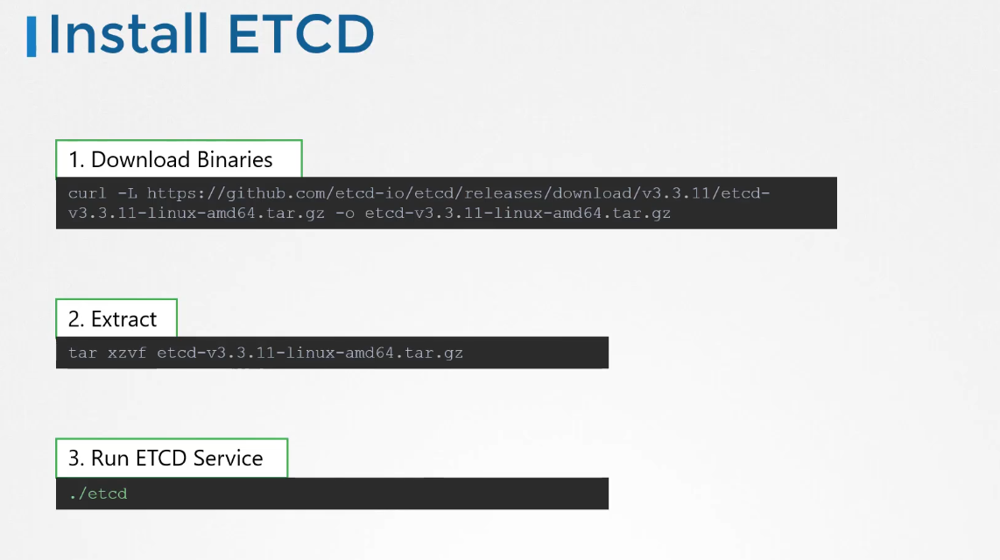


### ETCD in kubernetes

- store informations about the cluster (current state)
   * nodes
   * pods
   * configs
   * secrets
   * accounts
   * roles
   * bindings
   * others

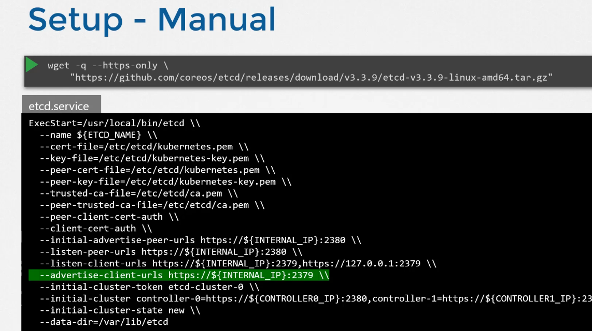

Voir le fichier "etcd-commands.md"


## Kube-API Server

On the master kube-api server, will be in charge of receiving commands like
 - `kubectl` from the user
 - authenticate the user
 - retrieve data on etcd (example the nodes list in case of a `kubectl get nodes`)
 - modify etcd if needed
 - play with the kube-scheduler and kubelet on the nodes

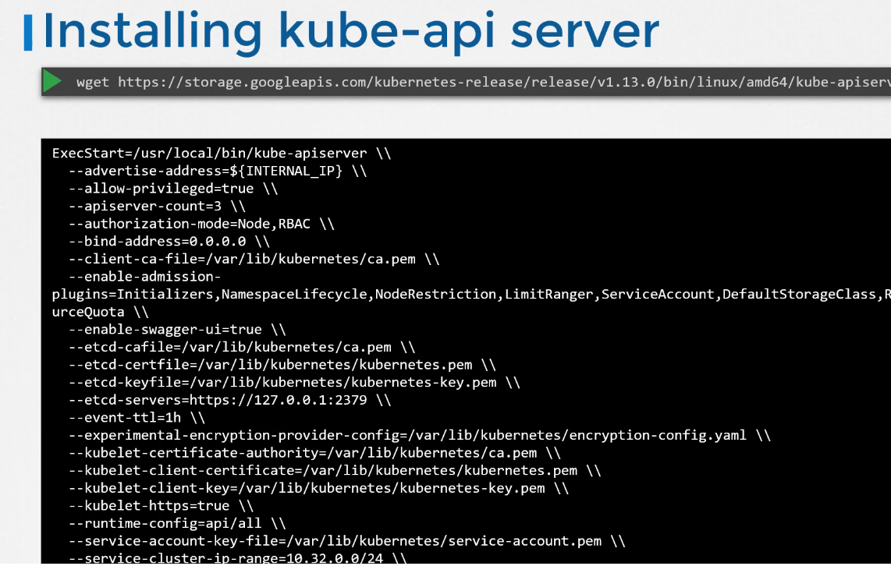


```
# See the configuration of the kube api server, on the master server
cat /etc/kubernetes/manifests/kube-apiserver.yaml

# See the pod via kubernetes
kubectl get pods -n kube-system | grep -i kube-apiserver

# See the service on the master node
ps -aux | grep -i kube-apiserver
```

## Kube Controller Manager

It's the BIG BRAIN

There are several controllers on a kubernetes cluster, they are included into the controller MANAGER
- node controller (in charge of node health and management) than will play through kube-api-server to make the whole stuff work
- replication controller (in charge of monitoring the state of replicasets)
- deployment controller
- job-controller
- namespace controller
- endpoint controller
- pv protection controller (in charge of monitoring state of Physical volumes)
- ...


Install the controller manager on the master

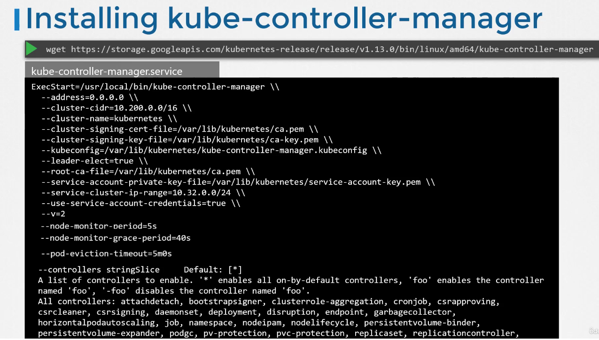

```
# see the configuration on the server 
cat /etc/kubernetes/manifests/kube-controller-manager.yaml

# See the configuration on the k8s server
kubectl get pods -n kube-system | grep -i kube-controller-manager-master

# See the config on the master server
ps -aux | grep -i kube-controller-manager
```


## Kube scheduler

Only responsible to say which node will host which pod.

Install kube scheduler on the master

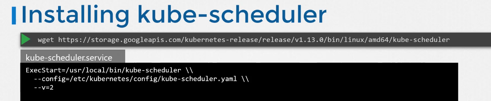

```
# See scheduler options on the master
cat /etc/kubernetes/manifests/kube-scheduler.yaml

# See the pod through kubectl
kubectl get pods -n jube-system | grep -i kube-scheduler

# See informations on the master server
ps -aux | grep -i kube-scheduler

```


## Kubelet

One kubelet on each node.
The contact point on the nodes, they constantly exchange with the master server to concretely know what they have to do.
Most of the time they are received and sending informations with/to the kube-apiserver to know what to do.

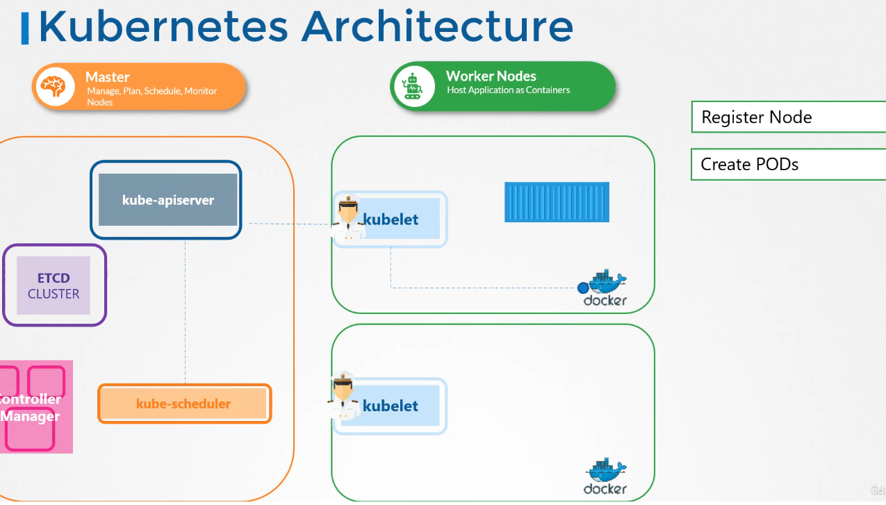

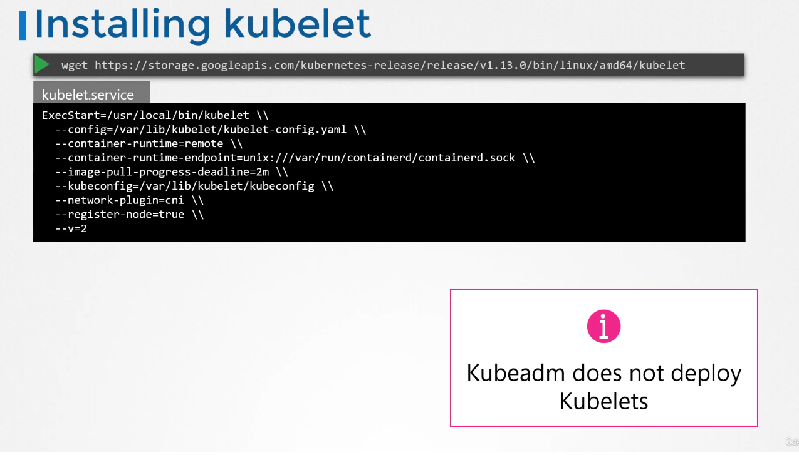

```
## See service information on each node

ps -aux | grep -i kubelet 

```

## Kube Proxy

On kube-proxy on each node.
To allow communication between pods, an internal network is deployed between all nodes : the `pod network`, with an internal pod network resolution service

**Kube-proxy**: To concretely pass from one node to another, a proxy has to be deployed, it's the kube-proxy, one kube-proxy per node.

```
# See through kubectl 
kubectl get pdos -A | grep -i kube-proxy
```


## About pods 

Nothing very exotic about pods here.

```
# that command will go search the public hub of docker
kubectl run nginx --image nginx:latest
```


Pod man page : https://kubernetes.io/docs/concepts/workloads/pods/


## Practice test

https://uklabs.kodekloud.com/topic/practice-test-pods-2/

```
kubectl run nginx --image=nginx
kubectl describe pod newpods-628s5 | grep -i image
kubectl get pods -o wide

kubectl get pods
# READY column => number of container fully functionnal in the pod / total number of containers in the pod

kubectl run redis --image=redis123
```
## About replicasets

Nothing very exotic here

Some kind of deployments where you can add a deterministic name for pods "mypod-1, mypod-2 mypod-3..."


Rappel : les replicationset et les replicationcontrollers font peu ou prou la même chose, cependant 
- les **replication controllers** sont **legacy**
- les replicationsets sont une version plus récente

les deux prennent appui sur la description d'un pod qu'ils vont pouvoir repliquer un peu à la manière d'un déploiement

replication controllers
- https://kubernetes.io/docs/concepts/workloads/controllers/replicationcontroller/

Replicaset :
- https://kubernetes.io/docs/concepts/workloads/controllers/replicaset/


La commande "scale" de "kubectl" permet de changer le nombre de replicats d'un déploiement/replicaset

## practice test

https://uklabs.kodekloud.com/topic/practice-test-replicasets-2/

Replicasets endure that the number of desired pods always exist

Pour la correction du replicaset 
```
kubectl edit replicaset new-replicaset # puis modification de l'image
kubectl scale replicaset new-replica-set --replica=0
kubectl scale replicaset new-replica-set --replica=4
```
## Deployments

Nothing very exotic here

Page de man : https://kubernetes.io/docs/concepts/workloads/controllers/deployment/

**Petit Tip** pour créer des YAML rapidements

```
# generate a YAML file in one line, here a yaml for a deployment
kubectl create deployment --image=nginx nginx --dry-run=client -o yaml > nginx.yaml
```

## Practice

https://uklabs.kodekloud.com/topic/practice-tests-deployments-2/


## Services

Nothing exotic here about services

Man page : https://kubernetes.io/docs/concepts/services-networking/service/

We should know well what are and when we have to use the different service types.

Service type : 
- NodePort : where the service gets accessible on a port on the node  (access to the pod == curl http://<ip of the node>:<port associated to the pod>)
- ClusterIP : where the service gets an IP to enable communication between services
- Load Balancer : where the service is bound to an external load balancer
- externalname : associate the pod to a DNS value

Default type : ClusterIP


## Practice

https://uklabs.kodekloud.com/topic/practice-test-services-2/

Remember that the port that you wee on `kubectl get services` is the port and not the TargetPort
TargetPort is seen by doing `kubectl describe service xxxx`


## Namespace

Nothing exotic about namespaces here

Man page : https://kubernetes.io/docs/concepts/overview/working-with-objects/namespaces/

You can reach a pod in the same namesapce by its name, you can reach a pod in another namespace by `<pod>.<namespace>`

Informations about resourcequota : https://kubernetes.io/docs/concepts/policy/resource-quotas/

Informations about pod security admissions https://kubernetes.io/docs/concepts/security/pod-security-admission/

Note : 
**Pod security policies are deprecated** since k8s 1.21 and are removed in 1.25 so they should be ignored by now.


## Practice

https://uklabs.kodekloud.com/topic/practice-test-namespaces-2/

Service is available between two namespaces :
`dbservice.dev.svc.cluster.local`

## Imperative vs Declarative

The way you describe a need

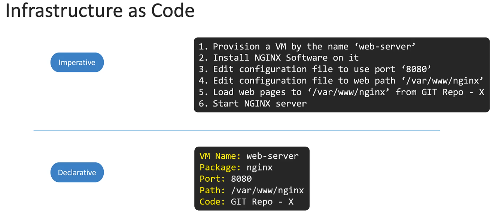

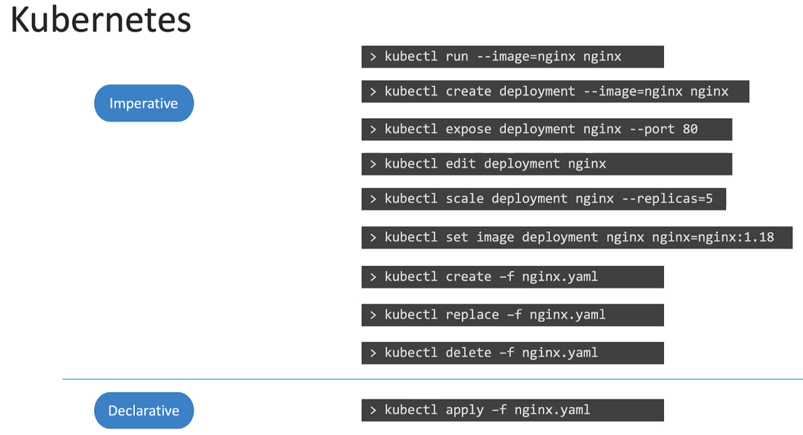


See the file `imperativecommand.md` for examples and details


## Practice

https://uklabs.kodekloud.com/topic/practice-test-imperative-commands-3/


kubectl apply -f nginx.yaml

```
apiVersion: v1
kind: Pod
metadata:
  name: redis
  labels:
    tier: db
spec:
  containers:
  - name: redis
    image: redis:alpine
```

Example of imperative commands

```
kubectl expose pod redis-service --type=ClusterIP --port 6379 --dry-run=client -o yaml > service.yaml

kubectl create deploy webapp --image kodekloud/webapp-color --replicas=3

kubectl run custom-nginx --image nginx --port 8080

kubectl create namespace dev-ns

kubectl create deployment redis-deploy --image redis --replicas 2 -n dev-ns

kubectl run httpd --image=httpd:alpine --port 80 --expose=true # port 80 was not in the request BUT it created the service in the end


kubectl expose pod httpd --type=ClusterIP --name=httpd-service --port=80 --target-port=80
Note : This command is correct, has passed, works, but the test never validated it since it wasn't the expected way
```

