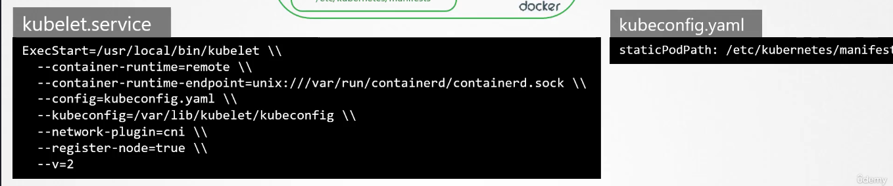

# Scheduling

About the capacity of deploying a pod
Eventually defining which node and how to choose the node

```
nodename: blablabla
```


## Practice

https://uklabs.kodekloud.com/topic/practice-test-manual-scheduling-2/


Example of scheduling on a node named `node01`

```
---
apiVersion: v1
kind: Pod
metadata:
  name: nginx
spec:
  containers:
  -  image: nginx
     name: nginx
  nodeName: node01
```

Note we can update by replace

```
kubectl replace --force -f nginx.yaml
```

## Labels and selectors

Label : usually report of the object itself

```
metadata:
  labels:
    app: my-app
    environment: production
```

annotation : usually store additional informations

```
metadata:
  annotations:
    description: "This is the production version of the app"
    deployer: "john_doe"
```

Selectors : 

`kubectl get pods --selector app=my-app`

Some objects define a replicaset to allow a bound between an information and its description, it's usually kinds (like replicasets or deployments) which aim to create other kinds (like pods)

Example in the documentation page of deployments : https://kubernetes.io/docs/concepts/workloads/controllers/deployment/


## Practice

https://uklabs.kodekloud.com/topic/practice-test-labels-and-selectors-2/

```
kubectl get pods --selector env=dev

kubectl get all --selector env=prod -o wide

kubectl get all --selector env=prod,bu=finance,tier=frontend -o wide
```

## Taints and tolerations

Taint : a way to mark a node then being able to add tolerations on pods that will be scheduled on it.

Toleration : a setting on a pod that will allow it to be scheduled on a node with a matching taint.

`kubectl taint nodes nodename key=value:taint-effet`

Taint effect :
- NoSchedule
- PreferNoSchedule
- NoExecute

Taint effect is what will occure on pods that do NOT tolerate those taints.


Documentation page https://kubernetes.io/docs/concepts/scheduling-eviction/taint-and-toleration/

Example of taint: 
```
kubectl taint nodes node1 key1=value1:NoSchedule

This means that no pod will be able to schedule onto node1 unless it has a matching toleration.
```

Example of toleration:
```
apiVersion: v1
kind: Pod
metadata:
  name: nginx
  labels:
    env: test
spec:
  containers:
  - name: nginx
    image: nginx
    imagePullPolicy: IfNotPresent
  tolerations:
  - key: "example-key"
    operator: "Exists"
    effect: "NoSchedule"
```

## Practices

https://uklabs.kodekloud.com/topic/practice-test-taints-and-tolerations-2/

kubectl taint node node01 spray=mortein:NoSchedule

kubectl run mosquito --image=nginx

kubectl run mosquito --image=nginx --dry-run=client -o yaml

Then with modify to add tolerations

```
apiVersion: v1
kind: Pod
metadata:
  creationTimestamp: null
  labels:
    run: bee
  name: bee
spec:
  containers:
  - image: nginx
    name: bee
    resources: {}
  tolerations:
  - key: "spray"
    value: "mortein"
    effect: "NoSchedule"
  dnsPolicy: ClusterFirst
  restartPolicy: Always
status: {}
```

```
# remove a taint on a node
kubectl taint node controlplane node-role.kubernetes.io/control-plane-
```


## Node selector

When `nodename` will make you able to select a node for scheduling based on its name
then `nodeSelector` will make you able to select a node for scheduling based on other criteria like size, cpu, ...

documentation page : https://kubernetes.io/docs/concepts/scheduling-eviction/assign-pod-node/#nodeselector

Add a label to a node:

kubectl label nodes nodename labelkey=labelvalue

## Node affinity

An even more advanced way to schedule a pod based on caracteristics of a node a little like nodeSelector

Documentation page : https://kubernetes.io/docs/tasks/configure-pod-container/assign-pods-nodes-using-node-affinity/

Allowing a like of values accepted

```
spec:
  affinity:
    nodeAffinity:
      requiredDuringSchedulingIgnoredDuringExecution:
        nodeSelectorTerms:
        - matchExpressions:
          - key: topology.kubernetes.io/zone
            operator: In
            values:
            - antarctica-east1
            - antarctica-west1
```

TODO

A simplier comparison of 

- requiredDuringSchedulingIgnoredDuringExecution
- preferredDuringSchedulingIgnoredDuringExecution
- requiredDuringSchedulingRequiredDuringExecution


## Practice

https://uklabs.kodekloud.com/topic/practice-test-node-affinity-3/

kubectl label nodes node01 color=blue

No taint -> a deployment without tolerations can be scheduled on aaaaall nodes


```
apiVersion: apps/v1
kind: Deployment
metadata:
  name: blue
  labels:
    app: nginx
spec:
  replicas: 3
  selector:
    matchLabels:
      app: nginx
  template:
    metadata:
      labels:
        app: nginx
    spec:
      affinity:
        nodeAffinity:
          requiredDuringSchedulingIgnoredDuringExecution:
            nodeSelectorTerms:
              - matchExpressions:
                  - key: color
                    operator: In
                    values:
                      - blue
      containers:
        - name: nginx
          image: nginx
          ports:
            - containerPort: 80
```


```
apiVersion: apps/v1
kind: Deployment
metadata:
  name: red
  labels:
    app: nginx
spec:
  replicas: 2
  selector:
    matchLabels:
      app: nginx
  template:
    metadata:
      labels:
        app: nginx
    spec:
      affinity:
        nodeAffinity:
          requiredDuringSchedulingIgnoredDuringExecution:
            nodeSelectorTerms:
              - matchExpressions:
                  - key: node-role.kubernetes.io/control-plane
                    operator: Exists
      containers:
        - name: nginx
          image: nginx
          ports:
            - containerPort: 80
```

TODO : To be retried


kubectl create deployment example --image=nginx --replicas=2  --dry-run=client -o yaml

## Taint and Toleration vs Node affinity

TODO : find another source

## Resource requirement and limits

Nothing very exotic

Documentation pages : 

https://kubernetes.io/docs/concepts/configuration/manage-resources-containers/
https://kubernetes.io/docs/concepts/workloads/controllers/deployment/


Manage cpu memory and api resource
https://kubernetes.io/docs/tasks/administer-cluster/manage-resources/
limitrange for cpu
https://kubernetes.io/docs/tasks/administer-cluster/manage-resources/cpu-default-namespace/
limitrange for memory
https://kubernetes.io/docs/tasks/administer-cluster/manage-resources/memory-default-namespace/

Edit a POD

Remember, you CANNOT edit specifications of an existing POD other than the below.

    spec.containers[*].image

    spec.initContainers[*].image

    spec.activeDeadlineSeconds

    spec.tolerations

## Practice

https://uklabs.kodekloud.com/topic/practice-test-resource-limits-2/


OOMKilled => the pod have been killed because the pod ran out of memory


## Daemonsets

Some kind of deployments where a pod is deployed on EACH of ALL nodes of the cluster

 

Daemonsets documentation : https://kubernetes.io/docs/concepts/workloads/controllers/daemonset/

## Practice

kubectl get daemonsets -A

https://uklabs.kodekloud.com/topic/practice-test-daemonsets-2/

kubectl describe daemonset kube-flannel-ds -n kube-flannel | grep -i image


extracted from the documentation : 

```
apiVersion: apps/v1
kind: DaemonSet
metadata:
  name: elasticsearch
  namespace: kube-system
  labels:
    k8s-app: fluentd-logging
spec:
  selector:
    matchLabels:
      name: fluentd-elasticsearch
  template:
    metadata:
      labels:
        name: fluentd-elasticsearch
    spec:
      containers:
      - name: fluentd-elasticsearch
        image: registry.k8s.io/fluentd-elasticsearch:1.20
      terminationGracePeriodSeconds: 30
```


## Static pods

static pod : a pod that is directly managed by the kubelet on a node, rather than by the Kubernetes API server or the Kubernetes controller manager.


Example of static pod : see the config file in the kubelet description, the static pod is described in the kubelet configuration file.




Create static pod : https://kubernetes.io/docs/tasks/configure-pod-container/static-pod/


## Practice

https://uklabs.kodekloud.com/topic/practice-test-static-pods-2/

list static pods : 

kubectl get pods --all-namespaces -o json | jq -r '.items | map(select(.metadata.ownerReferences[]?.kind == "Node" ) | .metadata.name) | .[]'

ANOTHER EASIER WAY TO DO IT : 

When you describe de pod there is a section "OwnerReferences", when the pod static, the owner is "kind:node"

Here an example of kubectl describe pod blablabla


So a very simple way to detect a static pod is 

```
kubectl describe pod balblabla | grep -i "kind: node"
```

Path for configuration of static configuration : /etc/kubernetes/manifests/

ls /etc/kubernetes/manifests/

kubectl describe pod kube-apiserver-controlplane -n kube-system | grep -i image

```
kubectl run static-busybox --image=busybox -o yaml --dry-run=client --command -- sleep 1000 > static.yaml
```
 
On the destruction of the static pod green-busybox, we were supposed to have a file related to this pod in /etc/kubernetes/manifests/ which wasn't the case.
BUT THAT'S THE TRAP HERE :)

To remove it we 
- see which node hosts the pod
- we ssh on the node
- open the kubelet config file `/var/lib/kubelet/config.yaml` 
- search for the variable `staticPodPath`
- we identify the describer directory `/etc/just-to-mess-with-you` :)
- we go to the directory
- we remove the file `green.yaml`
- we can logout from the host node
The pod will be terminated after a few dozens of seconds. 


## Multiple Schedulers

We all know the kube-scheduler in charge of choosing which node will host a pod.
BUT we can have several custom schedulers

https://kubernetes.io/docs/reference/scheduling/config/

Default scheduler

```
apiVersion: kubescheduler.config.k8s.io/v1
kind: KubeSchedulerConfiguration
profiles:
  - schedulerName: default-scheduler
```

Other scheduler

```
apiVersion: kubescheduler.config.k8s.io/v1
kind: KubeSchedulerConfiguration
profiles:
  - schedulerName: other-scheduler
```

Let's guess that you want some additional schedulers, it will be concretely to add additional linux services as "kubelet" on EVERY NODE


You can deploy them as deamonsets too : 


Documentation about multiple schedulers : https://kubernetes.io/docs/tasks/extend-kubernetes/configure-multiple-schedulers/
In the documentatin, the scheduler is deployed as a `Deployment` kind with all that might be useful to make it (configmap, clusterRole...)

No real stuff to detect a scheduler from another pod except by the name.

The scheduler can be configured on the pod/deployment needed by configuration.

```
apiVersion: v1
kind: Pod
metadata:
  name: annotation-default-scheduler
  labels:
    name: multischeduler-example
spec:
  schedulerName: default-scheduler
  containers:
  - name: pod-with-default-annotation-container
    image: registry.k8s.io/pause:3.8
```

Get INFORMATION ABOUT THE CLUSTER !! and about the scheduling events

```
kubectl get events -o wide
```
or event better on 

```
kubectl logs -f pod-blablabla-scheduler -n kube-system
```

## Practices

https://uklabs.kodekloud.com/topic/practice-test-multiple-schedulers-2/


Know the scheduler that scheduled a specific pod ?

???

In the solution he only looks for a pod named ****-scheduler, but a filter on "sheduler" in description of pods help to look it for real.

Create scheduler

A kind `KubeSchedulerConfiguration` is to be considered as a configmap that will be mounted on a pod (eventually via deployment/daemonset) for the logic. 
```
apiVersion: kubescheduler.config.k8s.io/v1
kind: KubeSchedulerConfiguration
profiles:
  - schedulerName: my-scheduler
leaderElection:
  leaderElect: fals
```

+ Pods

TODO : redo this practice


Pod with custom scheduler : 

```
apiVersion: v1 
kind: Pod 
metadata:
  name: nginx 
spec:
  containers:
  - image: nginx
    name: nginx
  schedulerName: my-scheduler
```

## Configuring Scheduler Profiles

It's about `priorityClassName` and how a list of pods to be scheduled can be prioritized.

```
apiVersion: scheduling.k8s.io/v1
kind: PriorityClass
metadata:
  name: high-priority-nonpreempting
value: 1000000
preemptionPolicy: Never
globalDefault: false
description: "This priority class will not cause other pods to be preempted."
```

And here a pod with priority class changed from default

```
apiVersion: v1
kind: Pod
metadata:
  name: nginx
  labels:
    env: test
spec:
  containers:
  - name: nginx
    image: nginx
    imagePullPolicy: IfNotPresent
  priorityClassName: high-priority

```


Note : default priority value is `0` an arbitrary value higher than 0 will make the associated pod more prioritized than a pod associated to the default priority.

Order of scheduling : 


TODO : read a little more about scheduler profiles

```
https://github.com/kubernetes/community/blob/master/contributors/devel/sig-scheduling/scheduling_code_hierarchy_overview.md
https://kubernetes.io/blog/2017/03/advanced-scheduling-in-kubernetes/
https://jvns.ca/blog/2017/07/27/how-does-the-kubernetes-scheduler-work/
https://stackoverflow.com/questions/28857993/how-does-kubernetes-scheduler-work
```

Preemption : the possibility to force even MORE than with the priority class
Most of the preemption will be `preemption:never` which is the default value.


## Admission controllers

https://kubernetes.io/docs/reference/access-authn-authz/admission-controllers/

**Admission controller :** a security check that makes sure a request to create or change something in Kubernetes follows certain rules before it's allowed to happen.
It's supported by the `kube-apiserver`

To see which admission plugins are enabled: `kube-apiserver -h | grep enable-admission-plugins`

Documentation : https://kubernetes.io/docs/reference/access-authn-authz/admission-controllers/


We could imagine to have an admissioncontroler able to auto create a namespace or a storage class

## Practices

https://learn.kodekloud.com/user/courses/udemy-labs-certified-kubernetes-administrator-with-practice-tests/module/8e4261a6-bac4-4dfe-82c5-0a1bb8c527da/lesson/d9398583-1f11-4b74-a8ee-2bc0790f3193

Admission controler is NOT made to authenticate

Namespaceautoprovision is NOT enabled by default


List enabled admissioncontrollers
- Connect on the controlplane
- Open `cat /etc/kubernetes/manifests/kube-apiserver.yaml | more`
- locate the line `--enable-admission-plugins`, it will list the enabled admission controllers


```
kubectl run nginx --image nginx -n blue
Error from server (NotFound): namespaces "blue" not found
```

To add a new Admission controller without going through all node : 
- connect on the controlplane server
- edit the file /etc/kubernetes/manifests/kube-apiserver.yaml
- locate the line `--enable-admission-plugins`
/
```
spec:
  containers:
  - command:
    - kube-apiserver
    - --advertise-address=192.168.117.36
    - --allow-privileged=true
    - --authorization-mode=Node,RBAC
    - --client-ca-file=/etc/kubernetes/pki/ca.crt
    - --enable-admission-plugins=NodeRestriction
```

- add a new admission controller , here we add NamespaceAutoProvision

`   --enable-admission-plugins=NamespaceAutoProvision,NodeRestriction`

- Save and wait, the pod kube-apiserver will kindly reboot.

```
kubectl run nginx --image=nginx -n blue
```


OF COURSE to disable an Admission Controller, there is a `--disable-admission-plugins` to explicitely disable an Admission Controller in /etc/kubernetes/manifests/kube-apiserver.yaml on the controlplane

`--disable-admission-plugins=DefaultStorageClass`

Once the modification is done, wait a few minutes for the kube-api pods to reboot


## Validating and mutating access controllers

Meh, maybe find another source.

It's about Admission webhooks

admission webhooks: a way to extend the functionality of the Kubernetes API 
Admission webhooks are used to run custom logic to approve, reject, or modify Kubernetes API requests before the resource is saved to the cluster.

Example :
Imagine you want every Pod to have a specific label. An admission webhook can automatically add that label whenever a Pod is created, so you don’t have to do it manually every time.

Another example should be good to explore it.


## Practices

https://learn.kodekloud.com/user/courses/udemy-labs-certified-kubernetes-administrator-with-practice-tests/module/8e4261a6-bac4-4dfe-82c5-0a1bb8c527da/lesson/1f3b6bb8-1b60-486a-b7da-08c8c33d8508

Create a tls secret named `webhook-server`: 

```
kubctl -n webhook create secret tls webhook-server-tls --cert "/root/keys/webhook-server-tls.crt" --key "/root/keys/webhook-server-tls.key"
```

TODO: Maybe an other example of admission webhook on another source could be good.

================

Multiple scheduler
-> soit déployé en tant que daemonset
-> soit déployé via une modification du kubelet dans le controlplane, ce qui va faire que sur les prochains nodes il y aura le scheduler de proposé
-> il faudra encore que le pod prenne le bon scheduler

