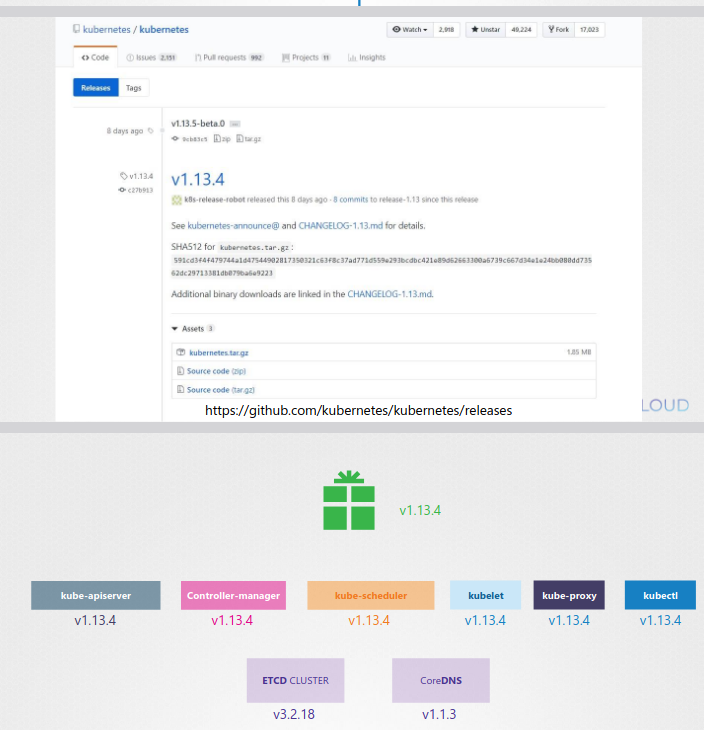
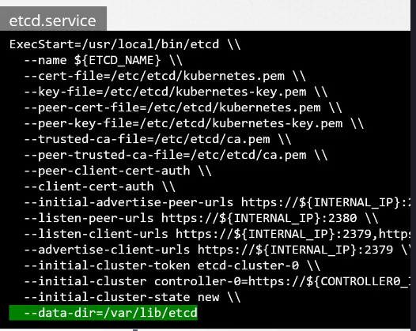

# Cluster Maintenance

## commands

clean nodes

```
kubectl drain <node name>
kubectl cordon <node name> # forbid to schedule pods on this node
kubectl uncordon <node name> # allow to schedule pods on this node
```

see node version

`kubectl get nodes`

##OS Upgrades
About upgrading nodes and clusters

No many information in this chapter

## Practices

https://uklabs.kodekloud.com/topic/practice-test-os-upgrades-2/

```
kubectl get nodes
kubectl get deployments
kubectl get pods -o wide
kubectl drain node01 --ignore-daemonsets
kubectl get nodes #node01 is unscheduled
kubectl uncordon node01 #node01 become schedulable again

#since controlplane has no taint, it's perfectly possible for pods to be hosted on this node

kubectl drain node01 --ignore-daemonsets
# error : unable to drain node "node01" due to error: cannot delete cannot delete Pods that declare no controller (use --force to override)
# BECAUSE : there is a pod which is not part of a replicaset

kubectl drain node01 --ignore-daemonsets --force
# force the destruction of pod locking the drain


kubectl cordon node01 # make the node unschedulable without destroying what is hosted on it.
```


## Kubernetes releases and version

kubectl get nodes # know the versions



https://kubernetes.io/docs/concepts/overview/kubernetes-api/

Here is a link to kubernetes documentation if you want to learn more about this topic (You don't need it for the exam though):

https://github.com/kubernetes/community/blob/master/contributors/devel/sig-architecture/api-conventions.md

https://github.com/kubernetes/community/blob/master/contributors/devel/sig-architecture/api_changes.md


## Cluster upgrade process

- kube-apiserver
- controller-manager
- kube-scheduler
- kubelet
- kube-proxy
- kubectl

The components should not be more than +1 version than de kube-apiserver.
The recommended approach (and the one forced by public clouders like AWS/GCP) is to upgrade versions one by one in case you are several versions late.

- Upgrade the controlplane+the kubeapiserver
- Upgrade nodes

Tool to upgrade a cluster : `kubeadm`

```
kubeadm upgrade plan # will give you information about current version and what we can increase

# Step 1 : upgrade control plane

apt-get upgrade -y kubeadm=1.12.0
kubeadm upgrade plan
kubeadm upgrade apply v1.12.0
# SUCCESS your control plane is updated !

# Step 2 : upgrade the master node hosting the control plane
apt-get upgrade -y kubelet=1.12.0
systemctl restart kubelet

# Step 3 : upgrade your worker nodes (To be done for each node)
kubectl drain <node name>
# --------- ssh on node
apt-get upgrade -y kubeadm=1.12.0
apt-get upgrade -y kubelet=1.12.0
kubeadm upgrade node config --kubelet-version v1.12.0
systemctl daemon-reload
systemctl restart kubelet
# your nodes are now upgraded.
```

https://discuss.kubernetes.io/t/cluster-upgrade-strategy/3558/3

Even a better source recommended by the demo (chapter 140):
/!\ https://kubernetes.io/docs/tasks/administer-cluster/kubeadm/kubeadm-upgrade/

## Practice

TODO : redo the lab

https://uklabs.kodekloud.com/topic/practice-test-cluster-upgrade-process-2/
```
# Modify source to change kubeadm repository source to 1.32.0
nano /etc/apt/apt.sources.d/kubernetes.list
# --- 
apt-get upgrade kubeadm
kubeadm upgrade plan
kubectl drain controlplane --ignore-daemonsets
# since we already are on the control plane node
kubeadm upgrade apply 1.32.3
systemctl restart kubelet
kubectl uncordon controlplane
kubectl drain node01 --ignore-daemonsets
ssh node01
apt-get upgrade -y kubeadm
apt-get upgrade -y kubelet
kubeadm upgrade node # eventually we can add config --kubelet-version v1.32.3
systemctl daemon-reload
systemctl restart kubelet
```

## Backup and restore methods


What to save ?
- resource configuration
- etcd cluster
- persistent volumes 

Resource configuration -> save them on a git
`kubectl get all -A -o yaml > all-resources.yaml`

etcd cluster -> save data directory


To save : 
```
export ETCDCTL_API=3
etcdctl snapshot save snapshot.db
ls 
	snapshot.db
etcdctl snapshot status snapshot.db
	--> give back infos about the snapshot (hash, revision, total keys, total size)
```

To Restore :
```
export ETCDCTL_API=3
systemctl stop kube-apiserver
etcdctl snapshot restore snapshot.db --data-dir /var/lib/etcd-from-backup #default value of data-dir : /var/lib/etcd
# then change the value of data-dir in etcd.service to point on /var/lib/etcd-from-backup
# then
systemctl restart etcd
systemctl stop kube-apiserver
```

Documentation about etcd https://github.com/coreos/etcd


WARNING : it seems that etcdctl is DEPRECATED
TODO : relearn to save and restore etcd database, properly - find another source


Since our ETCD database is TLS-Enabled, the following options are mandatory:

`--cacert` : verify certificates of TLS-enabled secure servers using this CA bundle

`--cert` : identify secure client using this TLS certificate file

`--endpoints=[127.0.0.1:2379]`: This is the default as ETCD is running on master node and exposed on localhost 2379.

`--key` : identify secure client using this TLS key file

# Practices

https://uklabs.kodekloud.com/topic/practice-test-backup-and-restore-methods-2/

/!\ TODO : to be redone, I haven't been able to do the restauration

/!\ TODO : Properly learn the process

```
export ETCDCTL_API=3
etcdctl --version
cat /etc/kubernetes/manifests/etcd.yaml | grep -i listen-client-urls
ls /etc/kubernetes/pki/etcd/server.crt
	ca.crt  ca.key  healthcheck-client.crt  healthcheck-client.key  peer.crt  peer.key  server.crt  server.key

GO SEE backup_and_restore_etcd.md for the whole commands explanation

```


## PRACTICES - 2

https://uklabs.kodekloud.com/topic/practice-test-backup-and-restore-methods-2-3/

TODO : Redo it

Chapter 147-148

```
kubectl config view
kubectl config use-context cluster1
kubectl get nodes
kubectl config use-context cluster2
kubectl get nodes

external ETCD == no ETCD

To know the IP of the external ETCD IP
ssh cluster2-controlplane
cat /etc/kubernetes/manifests/etcd.yaml --> do not exists since we are on an external ETCD
So a good way to check ETCD IP is to look at the controlplane associated pod

kubectl describe pod blablabla-controlplane -n kube-system | grep -i etcd-servers

SO IP ==== https://192.168.14.5:2379

I didn't found the command to get the external ETCD IP Adress


See the default directory for data
ssh etcd-server
ps -ef | grep -i etcd
Then look for data-dir -->  /var/lib/etcd

List etcd members

ssh etcd-cluster1

etcdctl --endpoints=127.0.0.1:2379 \
        --cacert=/etc/etcd/pki/ca.pem \
        --cert=/etc/etcd/pki/etcd.pem\
        --key=/etc/etcd/pki/etcd-key.pem\
        member list

etcdctl snapshot restore /root/cluster2.db \
        --data-dir=/var/lib/etcd-data-new
#Then modifying the etcd.service file just like we did in the back_and_restore_commands.md that we saw earlier
systemctl daemon-reload
systemctl restart etcd
```

Do not forget to read `backup_and_restore_command .md`

## References

Read those links

https://kubernetes.io/docs/tasks/administer-cluster/configure-upgrade-etcd/#backing-up-an-etcd-cluster
https://github.com/etcd-io/website/blob/main/content/en/docs/v3.5/op-guide/recovery.md
https://www.youtube.com/watch?v=qRPNuT080Hk


