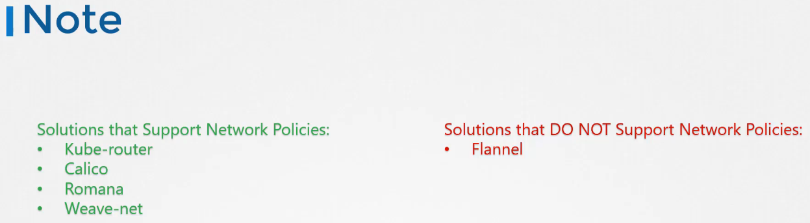
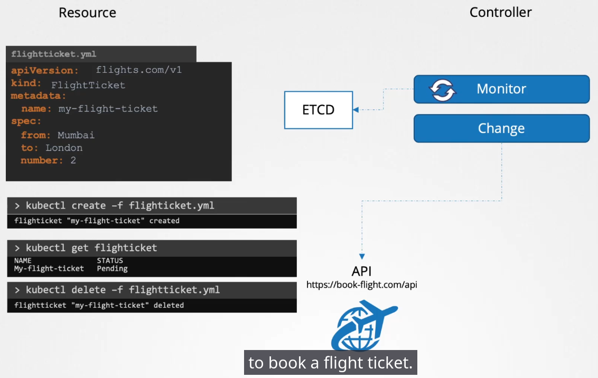
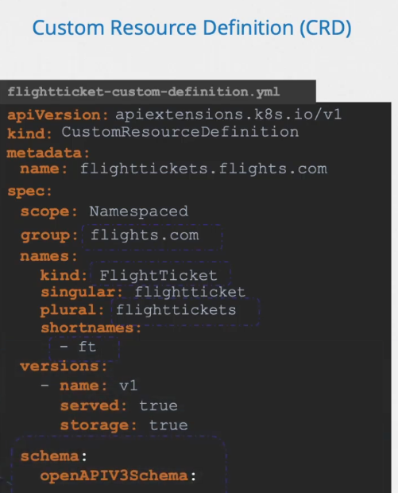
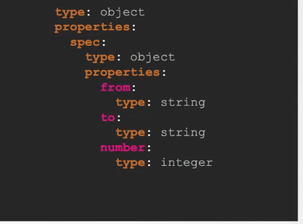

# Security

## Docker Security

docker run ubuntu sleep 3600
docker run --user=1000 ubuntu sleep 3600
docker run --cap-drop KILL ubuntu sleep 3600	# remove the capacity of using the "kill" command
docker run --privileged ubunbu sleep 3600	# 
docker run --cap-add MAC_ADMIN ubuntun sleep 3600  # Allow to modify rules like SELinux

Documentation : https://kubernetes.io/docs/tasks/configure-pod-container/security-context/

```
apiVersion: v1
kind: Pod
metadata:
  name: security-context-demo
spec:
  securityContext:
    runAsUser: 1000
    runAsGroup: 3000
    supplementalGroups: [4000]
  containers:
  - name: sec-ctx-demo
    image: registry.k8s.io/e2e-test-images/agnhost:2.45
    command: [ "sh", "-c", "sleep 1h" ]
    securityContext:
      allowPrivilegeEscalation: false
```

## Practices

https://uklabs.kodekloud.com/topic/practice-test-security-contexts-2/

Nothing about user specified == run under root ( which is not exactly true...meh)

```
apiVersion: v1
kind: Pod
metadata:
  name: multi-pod
spec:
  securityContext:
    runAsUser: 1001
  containers:
  -  image: ubuntu
     name: web
     command: ["sleep", "5000"]
     securityContext:
      runAsUser: 1002
  -  image: ubuntu
     name: sidecar
     command: ["sleep", "5000"]
```


## Network Policy

Documentation: https://kubernetes.io/docs/concepts/services-networking/network-policies/

Not all network solutions support Network Policies



Keep in mind to always see the network policies from the point of view of the pod

Connect to the DB :

```
apiVersion: networking.k8s.io/v1
kind: NetworkPolicy
metadata:
  name: allow-connect-to-the-db-ingress
spec:
  podSelector:
    matchLabel:
       role: db
  ingress:
    - from:
      - podSelector: {}
      ports:
      - protocol: TCP
        port: 5432
  policyTypes:
  - Ingress

```


Allow all connections


```
---
apiVersion: networking.k8s.io/v1
kind: NetworkPolicy
metadata:
  name: allow-all-ingress
spec:
  podSelector: {}
  ingress:
  - {}
  policyTypes:
  - Ingress

```


If there are several elements in the `from` element, the target pods are valid only if they confirm ALL assertion

## Practices

https://uklabs.kodekloud.com/topic/practice-test-network-policies-2/

```
kubectl get netpol


---
apiVersion: networking.k8s.io/v1
kind: NetworkPolicy
metadata:
  name: test-network-policy
  namespace: default
spec:
  podSelector:
    matchLabels:
      name: internal
  policyTypes:
  - Egress
  egress:
  - to:
    - podSelector:
        matchLabels:
          name: payroll
    ports:
    - protocol: TCP
      port: 8080
  - to:
    - podSelector:
        matchLabels:
          name: mysql
    ports:
    - protocol: TCP
      port: 3306
```

We took the example of ingress+egress from this page
https://kubernetes.io/docs/concepts/services-networking/network-policies/
And we just kept the egress part

TODO : work a little more about networkpolicies to be sure to be relax with it.

## Custom Resource Definition (CRD)

https://kubernetes.io/docs/concepts/extend-kubernetes/api-extension/custom-resources/

Your own kind, associated to your own controller to interprete it.

The controller is usually coded in golang.

Basically the controller will constantly analyse the ETCD database of the cluster to search for a specific kind to interprete as an action to be done.





The controller itself can appear as a pod/deployment or a service on the control plane of the cluster.

It the example, we used a "FlightTicket" custom resource, but to be accepted by the cluster, a "Custom Resource Definition" must be defined first




So :
- define a CRD
- apply your own object from this CRD
- deploy a pod that will act as a controller

NOTE : there is recently an `operator framework` that will implement automatically a controller if a CRD is deployed on the cluster.

An operator is the evolution of a controller. A controller is a daemon that will make simple actions. A controller will go much farther and be able to achieve most complex tasks.

** All operators are custom controllers, but not all custom controllers are operators **


**Website referencing MANY operators :** `https://operatorhub.io/`


/!\TODO Chapter 195-196 do we have to know to develop a controller ? 
