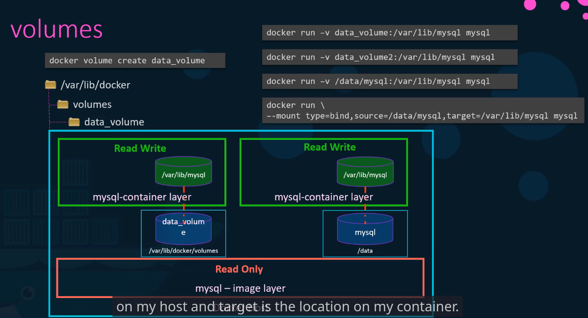
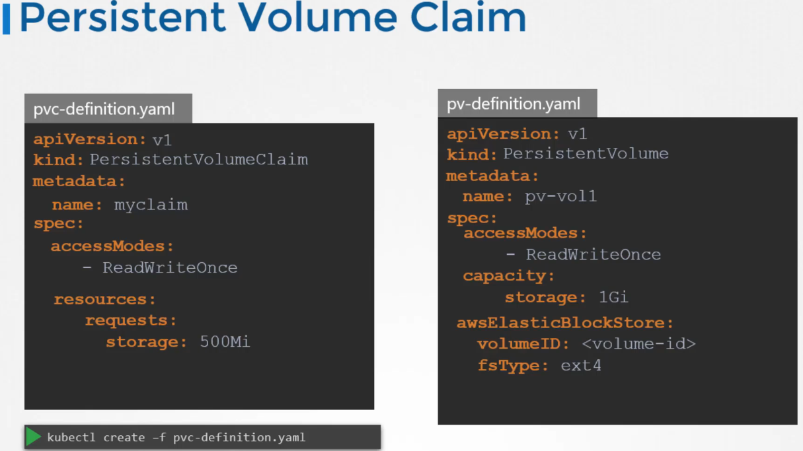

# Storage

## Bound between storage kinds

- volume
- volumeMounts
- mountpoint => NO it's mountPath
- persistent volume
- persistent volume claim
- volume driver
- CSI (container storage interface)
- StorageClass
- Storage driver

```
Storage driver ---- is the binary behind ----> StorageClass 


StorageClass
 | ------------ Use -----> CSI --- provide ---> volume configuration ---- is translated into Persistent storage by ----> Kubernete controlplane --- create ---> PVs 


Pod --- attach (via spec.containers[*].volumeMounts[*]) ---> volume (persistent or not) -> volume is created ONLY IF NOT PERSISTENT (see "volume in pod")
 | ---- request (via spec.volumes) --------------------------> |


Volume in pod ------------ (if ephemeral) ----------- Create ----------------------------> kind: volume  
 | -------- (if persistent) search for a PVC/PV and attach ----------> kind: PVC --- with storageclass parameter -----> Translate into kind: Persistent volume
                                                                            |------- without storage class parameter --> wait for a matching persistent volume to be created
```

When the pod requests :
 - an ephemeral storage, the volume is directly created
 - a persistent storage the volume is not directly created


A persistent volume storage is created via a persistentvolumeclaim which is a dedicated kind.


Example of creation of a pod containing a persistent storage :
https://kubernetes.io/docs/concepts/storage/persistent-volumes/

```
docker run -it --name mysql --volume-driver rexray/ebs --mount src=ebs-vol,target=/var/lib/mysql mysql
```

## About Docker standalone

### Where Docker locates storages

Depends on the kind of storage

- /var/lib/docker
- /aufs
- /containers
- /images
- /volumes



### Storage Drivers

Storage drivers:
- AUFS
- ZFS
- BTRS
- Device Mapper
- Overlay
- Overlay2

Volume drivers:
- local
- azure file storage
- netapp
- vmware vsphere storage


## Volumes (persistent or not)

**Volumes :** Allow to store data that will survive to the reboot of a pod, BUT it's destroyed with the pod if the pod is destroyed.
**Persistent volumes :** Allow to store data, but will persist even if the pod is destroyed and have its own lifecycle.

A pod can attach a volume, the syntax is only a little different between an ephemeral or a persistent volume 
Objects like configmaps can be seen as volumes, and be attached to a pod.

```
apiVersion: v1
kind: Pod
metadata:
  name: configmap-pod
spec:
  containers:
    - name: test
      image: busybox:1.28
      command: ['sh', '-c', 'echo "The app is running!" && tail -f /dev/null']
      volumeMounts:
        - name: config-vol
          mountPath: /etc/config
  volumes:
    - name: config-vol
      configMap:
        name: log-config
        items:
          - key: log_level
            path: log_level.conf
```

About volumes : https://kubernetes.io/docs/concepts/storage/volumes/
About persistent volumes : https://kubernetes.io/docs/concepts/storage/persistent-volumes/

Note :
right under The example of a persistent storage.
The good practice now is to use a persistentvolumeclaim, that will request a storage class, that will trigger the creation of a persistent volume.

```
apiVersion: v1
kind: PersistentVolume
metadata:
  name: pv0003
spec:
  capacity:
    storage: 5Gi
  volumeMode: Filesystem
  accessModes:
    - ReadWriteOnce
  persistentVolumeReclaimPolicy: Recycle
  storageClassName: slow
  mountOptions:
    - hard
    - nfsvers=4.1
  nfs:
    path: /tmp
    server: 172.17.0.2
```


## Persistent volume claims

**A Persistent Volume** is real space on a cluster, or a data storage.
**A persistent Volume Claim** is a request to use a part of this storage.
**A Storage Class** , beyond other stuff, can trigger the creation of a PV when a PVC is created.

Without Storage Class The PVC will wait for the PV (with the same name) to be created.


```
apiVersion: v1
kind: PersistentVolumeClaim
metadata:
  name: myclaim
spec:
  accessModes:
    - ReadWriteOnce
  volumeMode: Filesystem
  resources:
    requests:
      storage: 8Gi
  storageClassName: slow
  selector:
    matchLabels:
      release: "stable"
    matchExpressions:
      - {key: environment, operator: In, values: [dev]}
```




`kubectl delete volumepersistentclaim mypvc -n mynamespace`

Example of the attachment of the PVC : 

```
    apiVersion: v1
    kind: Pod
    metadata:
      name: mypod
    spec:
      containers:
        - name: myfrontend
          image: nginx
          volumeMounts:
          - mountPath: "/var/www/html"
            name: mypd
      volumes:
        - name: mypd
          persistentVolumeClaim:
            claimName: myclaim

```

## commandes
```
docker volume create volume
docker run -v data_volume:/var/lib/mysql mysql
```
- call to provision a new storage
- call to delete a new storage
- call to place a workload that uses the volume onto a node
- provision a new volume
- decommission a volume
- make the volume available on the node

TODO : traduire le chapitre en commandes
TODO : pour la certif connaitre en plus :
- définir un PVC
- définir un déploiement avec un volume attaché (que ce soit par un yaml ou de façon impérative)

## Practices


https://uklabs.kodekloud.com/topic/practice-test-persistent-volume-claims-2/

kubectl exec webapp -- cat /var/log/err.log

kubectl  get pod webapp -o yaml > webapp.yaml

then edit webapp.yaml

```
volumeMounts:
- mountPath: /var/log
  name: webapp
  readOnly: false	

[...]
volumes:
- name:  webapp
  hostPath:
    path: /var/log/webapp
```

kubectl replace --force -f webapp.yaml


TODO : LEARN PERFECTLY FOR THE EXAM - Chapter 207

```
apiVersion: v1
kind: PersistentVolume
metadata:
  name: pv-log
spec:
  persistentVolumeReclaimPolicy: Retain
  accessModes:
    - ReadWriteMany
  capacity:
    storage: 100Mi
  hostPath:
    path: /pv/log
```


I did the following by using the documentation only, and it works
```
apiVersion: v1
kind: PersistentVolumeClaim
metadata:
  name: claim-log-1
spec:
  accessModes:
    - ReadWriteOnce
  volumeMode: Filesystem
  resources:
    requests:
      storage: 50Mi
```

kubectl get persistentvolumeclaim --> It's pending
kubectl get persistentvolume --> It's available

Problem : 
- spec.volumeName = to be fixed
- spec.accessModes = should be changed from ReadWriteOnce to ReadWriteMany
----> YES !! keep in mind that the PV defined earlier was in ReadWriteMany, since we want a bound between the PV and the PVC, both have to define the same accessMode


Modification of the webapp.yaml to move for hostpath to a persistent volume claim

```
specs:
[...]
  volumes:
  - name: webapp
    persistentVolumeClaim:
      claimName: claim-log-1	
```

Per default reclaim policy of a persistent volume : RETAIN

In such situation, if you destroy the PVC, the PV is still available --> the status of the PV switch to "released"
Actually if you try to remove a PVC which is used by a pod, the deletion will be stuck, you have to delete the pod using a PVC before to delete the PVC


TODO : it seems that statefulsets are not covered in CKA, they are only in CKAD - see if it's still true


## Storage class

https://kubernetes.io/docs/concepts/storage/storage-classes/

Storage classes are cluster wide defined

When a PVC does not mention a storage class, you will have to create a PV matching the PVC caracteristics
When a PVC does mention a storage class, the storage will trigger the creation of the PV, that is the reason why most of the time a storage class is mentionned


Here a storage classe `standard`

```
apiVersion: storage.k8s.io/v1
kind: StorageClass
metadata:
  name: standard
provisioner:  example.com/example
parameters:
  type: pd-standard
volumeBindingMode: WaitForFirstConsumer
allowedTopologies:
- matchLabelExpressions:
  - key: topology.kubernetes.io/zone
    values:
    - us-central-1a
    - us-central-1b
```


And here a PVC using this storage class
```
apiVersion: v1
kind: PersistentVolumeClaim
metadata:
  name: my-pvc
spec:
  accessModes:
    - ReadWriteOnce
  resources:
    requests:
      storage: 5Gi
  storageClassName: standard
```

## Practice of storage class

https://uklabs.kodekloud.com/topic/practice-test-storage-class-3/

`kubectl get storageclass` 

If a storageclass provisionner value == `kubernetes.io/no-provisioner`, it means that the storage class does not support dynamic volume provisioning


TODO : understand this whole table

```
kubectl get storageclass
NAME                        PROVISIONER                     RECLAIMPOLICY   VOLUMEBINDINGMODE      ALLOWVOLUMEEXPANSION   AGE
local-path (default)        rancher.io/local-path           Delete          WaitForFirstConsumer   false                  8m28s
local-storage               kubernetes.io/no-provisioner    Delete          WaitForFirstConsumer   false                  47s
portworx-io-priority-high   kubernetes.io/portworx-volume   Delete          Immediate              false  
```

Example of simple PVC made to  bound with a PV
```
apiVersion: v1
kind: PersistentVolumeClaim
metadata:
  name: local-pvc
spec:
  accessModes:
    - ReadWriteOnce
  resources:
    requests:
      storage: 500Mi
  storageClassName: "local-storage"
  volumeName: local-pv
```


And to  simply create a pod with an attachement


First you create a pod

kubectl run nginx --image=nginx:alpine -o yaml > nginx.yaml

Then you add the volume


```
spec:
[...]
  volumes:
  - name: data
    persistentVolumeClaim:
      claimName: local-pvc
```

Then you add the volume mount to the container

```
spec:
  containers:
  - image: nginx:alpine
    name: nginx
    volumeMounts:
    - mountPath: "/var/www/html"
      name: data			# data is name associated to the volume for the pod
```


Then you deploy !


```
apiVersion: v1
kind: Pod
metadata:
  labels:
    run: nginx
  name: nginx
spec:
  containers:
  - image: nginx:alpine
    name: nginx
    resources: {}
    volumeMounts:
    - mountPath: "/var/www/html"
      name: data
  restartPolicy: Always
  volumes:
  - name: data
    persistentVolumeClaim:
      claimName: local-pvc
```


And to create a new storage class, we have copied an existing one (kubectl edit storageclass xxxx , then do a wrong modification to force the creation of an export)
and we have modified the copy as requested.

```
apiVersion: storage.k8s.io/v1
kind: StorageClass
metadata:
  name: delayed-volume-sc
provisioner: kubernetes.io/no-provisioner
reclaimPolicy: Delete
volumeBindingMode: WaitForFirstConsumer
```
