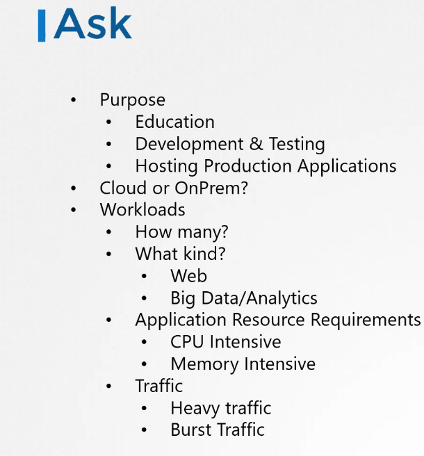
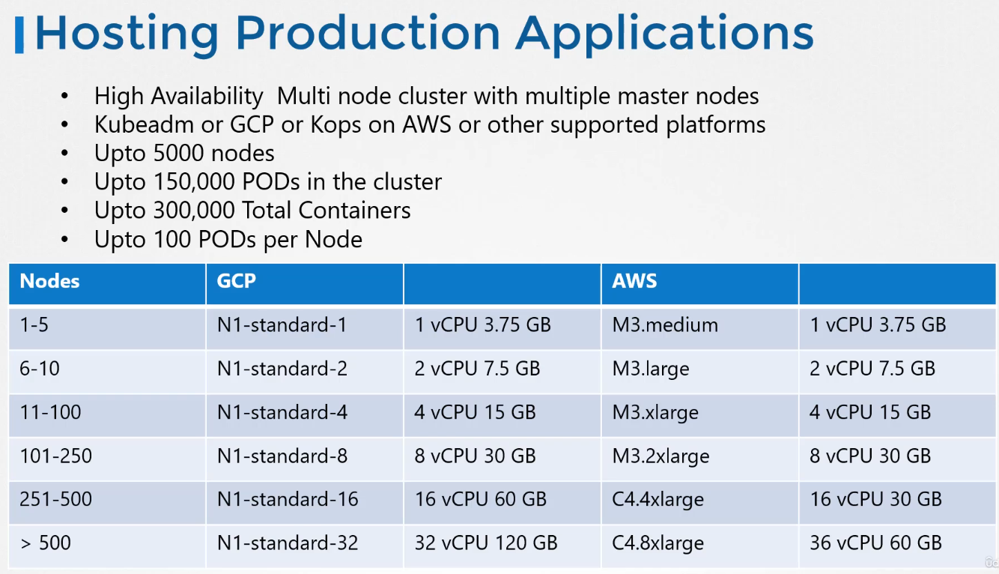
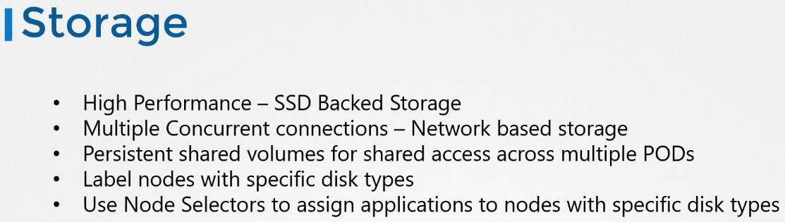
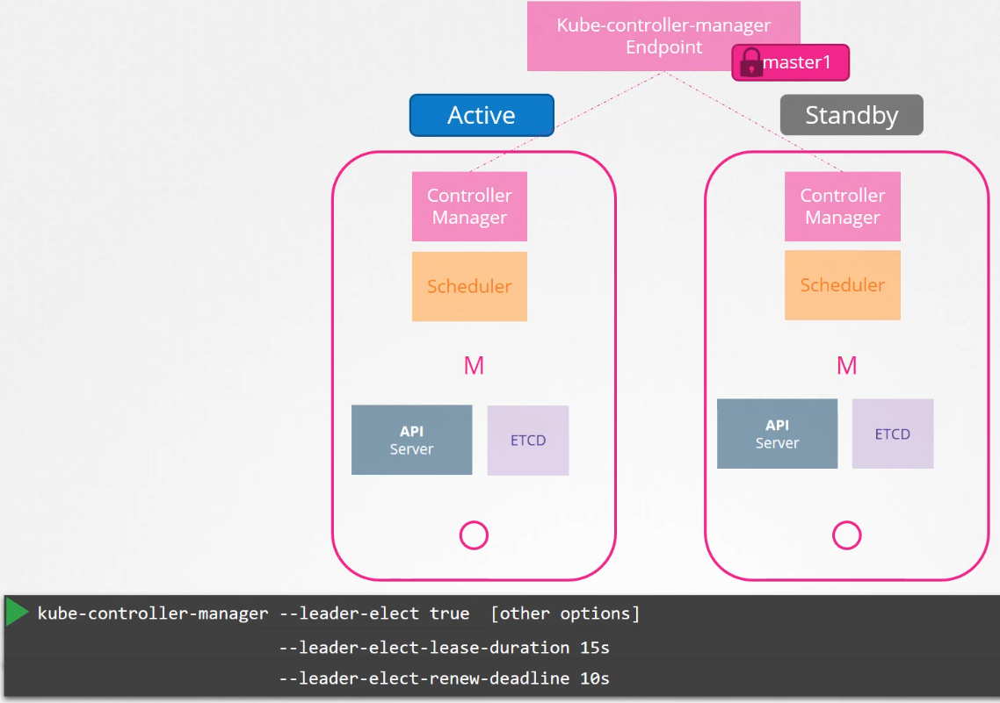

# Design and install a Kubernetes cluster








Not something very exotic in this whole chapter

- Minikube
  * deploy vm
  * signle node
- KubeADM
  * need vms to be ready
  * single/multi node
- K3S
- Openshift
- CloudFoundry Container runtime
- VMWare cloud PKS
- Vagrant

- GKE
- EKS
- AKS
- Openshift Online


## High Availability

Recommended : 
- two masters, active/active OR active/standby dedicated for
  * api-server
  * etcd
  * controller-manager
  * scheduler
- one or several workers
- at least two dedicated vm for ETCD (as much as masters)

When you have 2 masters, a kube-controller manager endpoint is elected to target one or other master.




About ETCD

Nothing very exotic about etcd

port 2379 : client request
port 2380 : communication between nodes (peer communication)

etcd is a key-value form database, a "store".
```
export ETCDCTL_API=3
etcdctl put name john
etcdctl get name
etcdctl get / --prefix --key		# List keys in the store
```


About installing Kubernetes

https://www.youtube.com/watch?v=uUupRagM7m0&list=PL2We04F3Y_41jYdadX55fdJplDvgNGENo
https://github.com/mmumshad/kubernetes-the-hard-way
