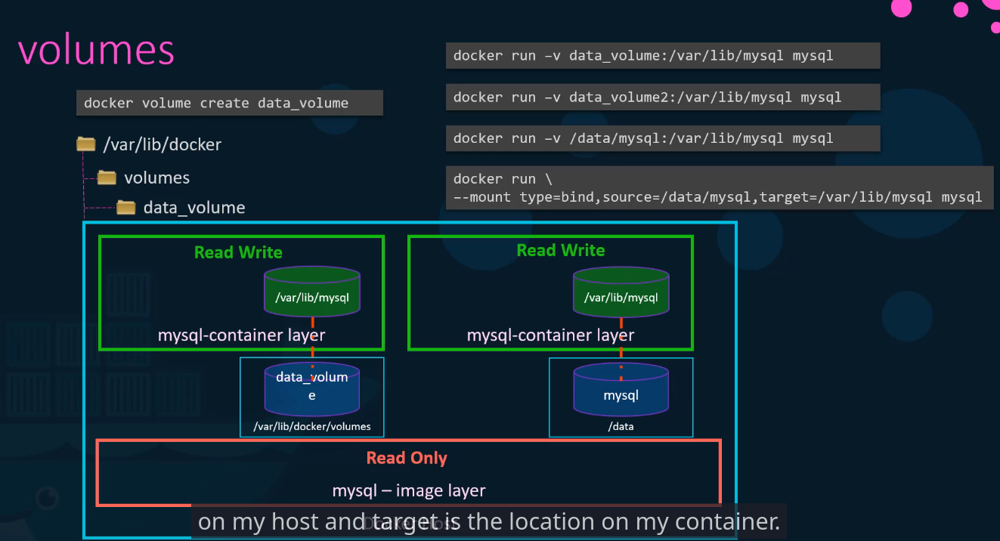
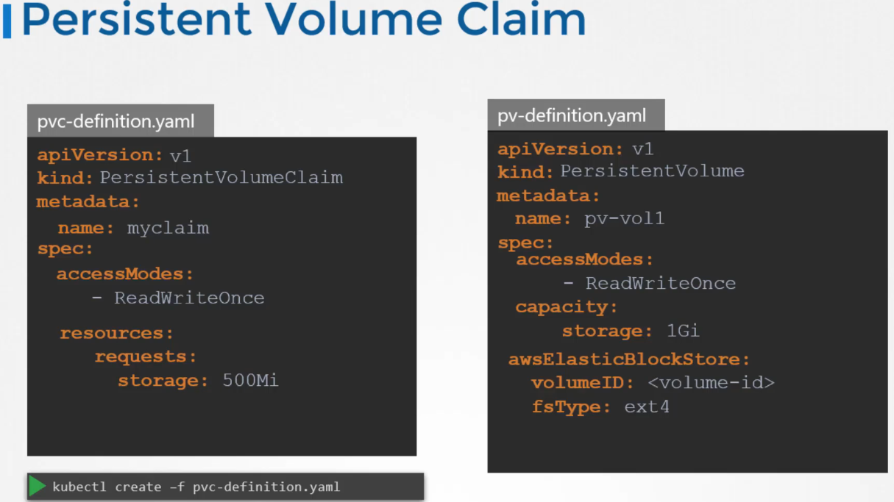

# Storage


- Storage driver
- Volume driver


## Storage in Docker

Storage of docker standalone

/var/lib/docker
/aufs
/containers
/images
/volumes



## Storage Drivers

Storage drivers:
- AUFS
- ZFS
- BTRS
- Device Mapper
- Overlay
- Overlay2

## Volume Drivers

If you want to persiste storage, you must create volumes

https://kubernetes.io/docs/concepts/storage/persistent-volumes/

```
docker run -it --name mysql --volume-driver rexray/ebs --mount src=ebs-vol,target=/var/lib/mysql mysql
```

## Volumes

**Volumes :** Allow to store data that will survive to the reboot of a pod, BUT it's destroyed with the pod if the pod is destroyed.
**Persistent volumes :** Allow to store data, but will persist event if the pod is destroyed and have its own lifecycle.

A persistent volume CANNOT BE attached to a pod. Only volumes and PVC can be attached to a pod.
Objects like configmaps can be seen as volumes, and be attached to a pod.

https://kubernetes.io/docs/concepts/storage/volumes/

```
apiVersion: v1
kind: Pod
metadata:
  name: configmap-pod
spec:
  containers:
    - name: test
      image: busybox:1.28
      command: ['sh', '-c', 'echo "The app is running!" && tail -f /dev/null']
      volumeMounts:
        - name: config-vol
          mountPath: /etc/config
  volumes:
    - name: config-vol
      configMap:
        name: log-config
        items:
          - key: log_level
            path: log_level.conf
```


## Persistent volumes

**Volumes :** Allow to store data that will survive to the reboot of a pod, BUT it's destroyed with the pod if the pod is destroyed.
**Persistent volumes :** Allow to store data, but will persist event if the pod is destroyed and have its own lifecycle.

https://kubernetes.io/docs/concepts/storage/persistent-volumes/

```
apiVersion: v1
kind: PersistentVolume
metadata:
  name: pv0003
spec:
  capacity:
    storage: 5Gi
  volumeMode: Filesystem
  accessModes:
    - ReadWriteOnce
  persistentVolumeReclaimPolicy: Recycle
  storageClassName: slow
  mountOptions:
    - hard
    - nfsvers=4.1
  nfs:
    path: /tmp
    server: 172.17.0.2
```

## Persistent volume claims

**A Persistent Volume** is real space on a cluster, or a data storage.
**A persistent Volume Claim** is a request to use a part of this storage.
**A Storage Class** , beyond other stuff, can trigger the creation of a PV when a PVC is created.

Without Storage Class The PVC will wait for the PV (with the same name) to be created.


```
apiVersion: v1
kind: PersistentVolumeClaim
metadata:
  name: myclaim
spec:
  accessModes:
    - ReadWriteOnce
  volumeMode: Filesystem
  resources:
    requests:
      storage: 8Gi
  storageClassName: slow
  selector:
    matchLabels:
      release: "stable"
    matchExpressions:
      - {key: environment, operator: In, values: [dev]}
```




`kubectl delete volumepersistentclaim mypvc -n mynamespace`

```
    apiVersion: v1
    kind: Pod
    metadata:
      name: mypod
    spec:
      containers:
        - name: myfrontend
          image: nginx
          volumeMounts:
          - mountPath: "/var/www/html"
            name: mypd
      volumes:
        - name: mypd
          persistentVolumeClaim:
            claimName: myclaim

```

## Practices

https://uklabs.kodekloud.com/topic/practice-test-persistent-volume-claims-2/

kubectl exec webapp -- cat /var/log/err.log

kubectl edit pod webapp

```
volumeMounts:
- mountPath: /var/log
  name: jenetrouvepasdenom
  readOnly: false	

[...]
volumes:
- name: log-volume
  hostPath:
    path: /var/log/webapp
```

Then get then file /tmp/hjfjhsefhjsf.yaml because it couldn't be replaced like that

kubectl replace --force -f /tmp/hjfjhsefhjsf.yaml

TODO : Exam à refaire je l'ai bypass, ce sujet est particulièrement important pour la CKA
Chapter 208-209


## Storage Class

A Refaire

A rajouter un sujet sur les modes de façon dont le PVC 

Etre très à l'aise sur la création des PV, et des PVC, et comment on les attache aux Pods

