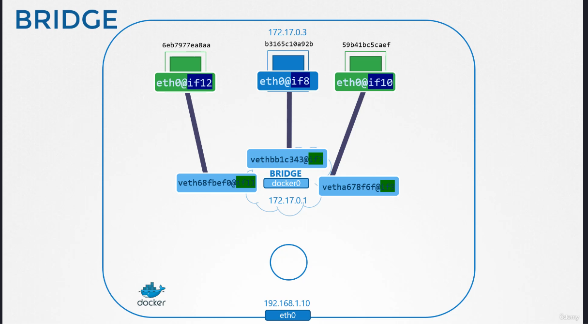
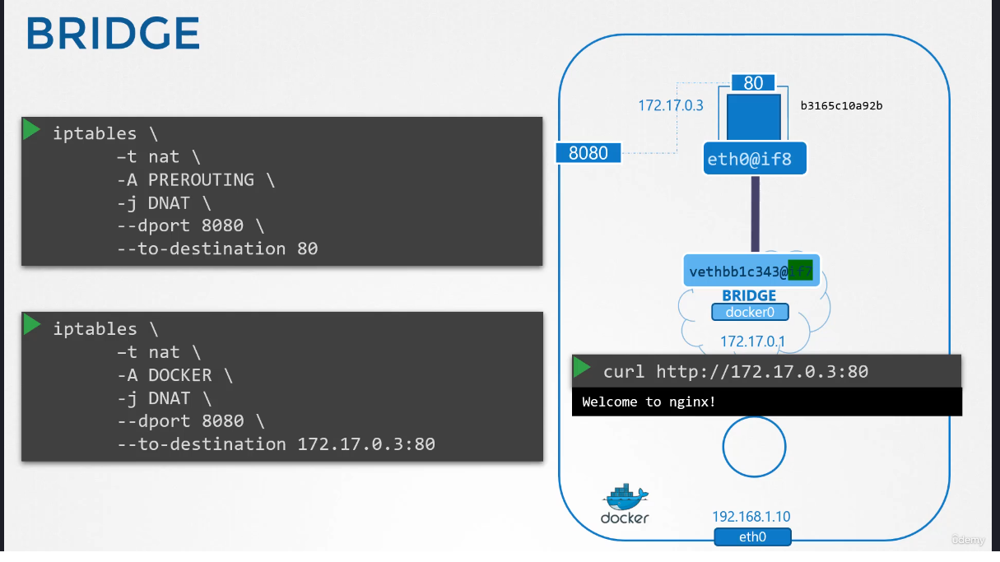
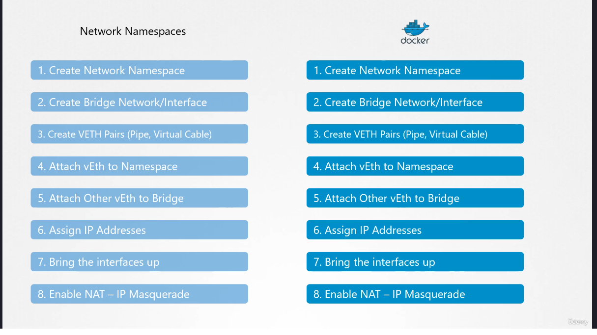
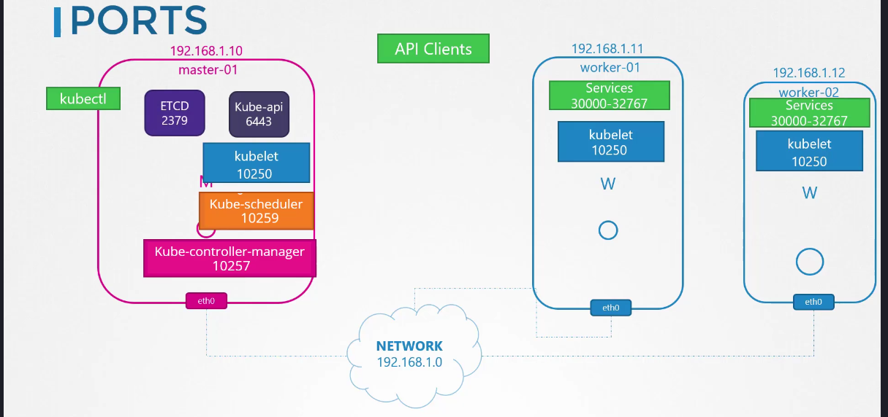
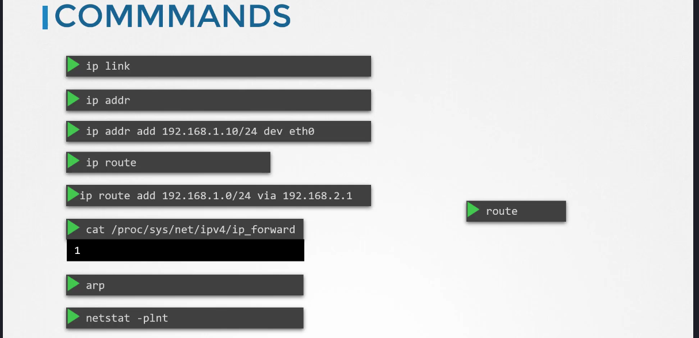

# Docker Networking

Docker network is built around a network named
- `bridge` in the docker mechanism ( via `kubectl network ls` )
- `docker0` on the host

The docker0 is stored in a network namespace ( just like in the basics we saw earlier )

The bridge is seen like an interface on the host. It can be seen by `ip addr docker0 | grep -i inet`

Whenever a container is created, Docker creates a network namespace for it.

```
### List network namespaces on the host
ip netsh

...
b3165**** reserved name for docker namespaces
```

So when Docker creates a container : 
- it creates the container
- it creates a virtual ethernet interface veth***** just like we did for our interface veth*_ns earlier
- it attach the virtual interface to the bridge docker0

Starting now the container is technically "pingable" through the bridge.



Starting now the container will get an IP (we will see later how the IP is given), for example `17.17.0.3`

and it's reachable **from the host** : 

```
curl https://172.17.0.3:80
Welcome to nginx !
```

but it's still not available from outside the host with a `no route to host` error.




## CNI



TODO : See chapter 222 for full explanation, it's important for the certification


## Cluster Networking

A cluster is made of unique : 
- a master node
- one or several worker nodes
- a master node can work as worker too



`+ port 2380 INPUT/OUPUT pour ETCD entre les master nodes s'ils existent`



https://kubernetes.io/docs/concepts/cluster-administration/addons/

https://kubernetes.io/docs/concepts/cluster-administration/networking/#how-to-implement-the-kubernetes-networking-model

NOTE : most of CNI / Network addons

Most of CNI are only two yamls that you deploy on the cluster, but it can be more difficult

## Practice

https://uklabs.kodekloud.com/topic/practice-test-explore-environment-2/


